# DT企业智能管理系统系统架构设计说明

> 文档目标：从技术视角解释 DT 企业智能管理系统的整体架构、代码组织、运行机制、前后端协作方式、关键业务链路、基础设施依赖、安全边界和扩展规范。
> 项目根目录：`e:\研发\dtcall`
> 当前文档目录：`documents`

---

## 1. 架构概述

DT 企业智能管理系统采用 Django 多应用模块化架构。系统以 `apps` 目录承载业务域，以 `dtcall` 包承载项目级配置，以 `templates` 和 `static` 承载统一前端模板与静态资源。整体架构具有以下特点：

1. **单体模块化架构**：系统不是微服务拆分，而是在一个 Django 项目内按业务域拆分应用模块。
2. **统一认证与权限核心**：全项目围绕自定义用户模型 `user.Admin` 构建用户、员工、权限、角色、菜单和业务负责人关系。
3. **传统 Django 模板前端**：前端主要使用 Django Templates、LayUI、jQuery、静态 CSS/JS，不存在独立 Node 前端工程。
4. **后台标签页工作区**：主界面使用 LayUI Tab + iframe，将菜单页面加载到右侧工作区。
5. **业务闭环能力完整**：覆盖客户、合同、项目、任务、审批、消息、财务、生产、库存、网盘、AI 等企业管理场景。
6. **AI 横向能力中台化**：`apps.ai` 提供模型配置、工作流、知识库、RAG、聊天、意图识别和日志反馈能力，多个业务模块通过 `ai_views.py` 横向接入。
7. **部署可容器化**：支持 Docker、docker-compose、Gunicorn、PostgreSQL、Redis 和 AI Orchestrator 侧车进程。

---

## 2. 总体技术架构

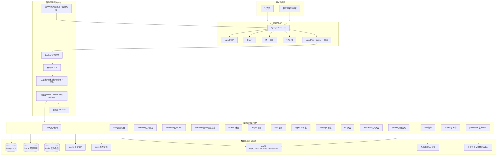

---

## 3. 技术栈明细

### 3.1 后端技术栈

| 类型 | 技术/依赖 | 用途 |
|---|---|---|
| Web 框架 | Django 5.2.1 | 项目主体框架、ORM、模板、路由、中间件 |
| API 框架 | djangorestframework | REST API、序列化、权限、分页、过滤 |
| JWT | djangorestframework-simplejwt | API Token 获取、刷新、校验 |
| 过滤 | django-filter | API 查询过滤 |
| 验证码 | django-simple-captcha | 登录验证码 |
| 缓存 | django-redis | Redis 缓存后端 |
| 实时/异步基础 | channels | 生产监控等实时能力基础依赖 |
| 数据库驱动 | psycopg2-binary | PostgreSQL 连接 |
| MySQL 兼容 | PyMySQL | MySQLdb 兼容适配 |
| Web 服务 | gunicorn | 生产 WSGI 服务 |
| 静态文件 | whitenoise | 静态文件服务支持 |
| 开发辅助 | django-debug-toolbar、django-extensions | 调试与开发扩展 |

### 3.2 前端技术栈

| 类型 | 技术/资源 | 用途 |
|---|---|---|
| 模板引擎 | Django Templates | 后端渲染页面 |
| UI 框架 | LayUI | 表格、表单、弹窗、标签页、导航、上传等 |
| DOM/AJAX | jQuery | 页面交互、AJAX、事件绑定 |
| HTTP | axios 静态库 | 部分页面 API 请求 |
| 轻量响应式 | Vue 静态库 | 部分静态页面或组件能力 |
| 图表 | ECharts/Chart.js 页面级使用 | 仪表盘、统计页面 |
| 样式 | `static/css/common.css`、模块 CSS | 统一后台样式、业务样式 |

### 3.3 数据与存储技术栈

| 类型 | 当前支持 | 说明 |
|---|---|---|
| 关系数据库 | PostgreSQL、SQLite fallback、MySQL 依赖兼容 | 生产推荐 PostgreSQL；本地未配置环境变量时 SQLite |
| 缓存 | Redis、LocMemCache fallback | Redis 用于缓存和会话；未配置时本地内存兜底 |
| 上传文件 | 本地 `media` | 默认上传文件存储位置 |
| 静态文件 | 本地 `static` | LayUI、CSS、JS、图片、图标资源 |
| 云存储 | OSS、COS、OBS、BOS、七牛、S3、WebDAV | 由系统存储配置相关模型和服务支撑 |

---

## 4. 项目目录架构

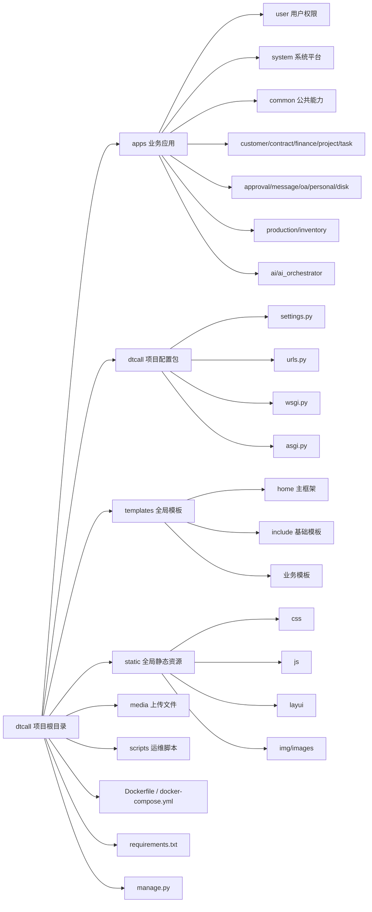

### 4.1 根目录职责

| 路径 | 职责 |
|---|---|
| `manage.py` | Django 命令入口，设置 `DJANGO_SETTINGS_MODULE=dtcall.settings` |
| `dtcall/settings.py` | 项目全局配置、应用注册、中间件、模板、数据库、缓存、静态文件、DRF、JWT 等 |
| `dtcall/urls.py` | 全局 URL 分发、模块路由挂载、旧路径兼容重定向、静态/媒体路由 |
| `dtcall/wsgi.py` | WSGI 入口，供 Gunicorn 等服务加载 |
| `dtcall/asgi.py` | ASGI 入口，为异步能力预留 |
| `apps/` | 所有业务应用模块目录 |
| `templates/` | 所有前端模板统一目录 |
| `static/` | 全局静态资源目录 |
| `media/` | 上传文件目录 |
| `requirements.txt` | Python 依赖清单 |
| `Dockerfile` | 容器镜像构建定义 |
| `docker-compose.yml` | PostgreSQL、Redis、Web、AI Orchestrator 服务编排 |

### 4.2 `apps` 目录职责

`apps` 是系统核心业务层，按业务域划分应用。所有新业务模块都应放在 `apps` 下，并遵循现有 Django 应用结构。项目规则明确禁止在 `apps` 内新增 `templates` 目录，模板应统一放在根目录 `templates` 下。

---

## 5. Django 配置架构

### 5.1 应用注册

系统注册了 Django 内置应用、第三方应用和业务应用。业务应用主要包括：

```text
user, customer, finance, common, contract, enterprise, oa, department,
project, work, position, home, task, approval, message, spider, disk,
system, personal, production, ai, ai_orchestrator, inventory
```

`AUTH_USER_MODEL = 'user.Admin'` 是系统最关键配置之一，意味着所有业务中的用户关联都应基于 `apps.user.models.Admin`，不得新建孤立用户模型。

### 5.2 中间件链路

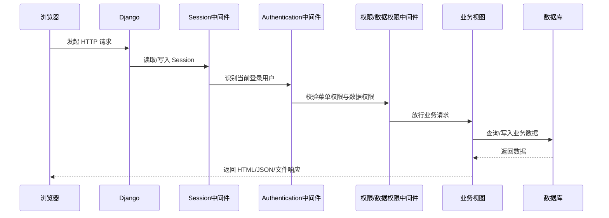

中间件重点：

| 中间件类别 | 作用 |
|---|---|
| Session 中间件 | 维护用户会话，当前 session engine 使用 cache backend |
| Authentication 中间件 | 识别当前登录用户 |
| 自定义会话中间件 | 项目级 session 行为增强 |
| 数据权限中间件 | 控制用户可访问的数据范围 |
| 权限中间件 | 控制用户访问菜单、页面、操作入口 |
| CSRF 中间件 | 表单与 AJAX 安全保护 |
| Clickjacking 中间件 | 防止页面被恶意嵌入 |

### 5.3 模板配置

模板入口统一为：

```text
templates/
```

模板上下文处理器中包括：

| 上下文处理器 | 作用 |
|---|---|
| `django.template.context_processors.request` | 模板中可访问 request |
| `django.contrib.auth.context_processors.auth` | 模板中可访问 user、perms |
| `django.contrib.messages.context_processors.messages` | Django messages 消息提示 |
| `apps.system.context_processors.get_menus` | 注入数据库菜单树 |
| `django.template.context_processors.static` | 静态资源 URL 支持 |
| `apps.system.context_processors.system_config` | 注入系统配置 |

### 5.4 数据库配置

数据库配置采用环境变量优先策略：

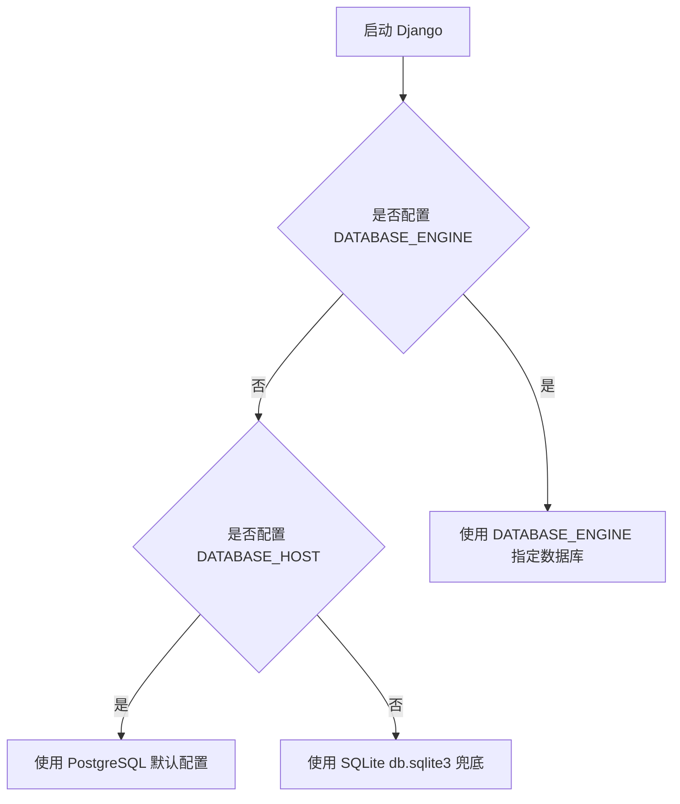

说明：

1. 生产部署推荐显式配置 PostgreSQL。
2. Docker Compose 默认使用 PostgreSQL 14 Alpine。
3. 本地未配置数据库环境变量时使用 SQLite，便于开发启动。
4. 不应在代码中硬编码数据库密码。

### 5.5 缓存配置

缓存配置采用 Redis 优先、本地内存兜底策略：

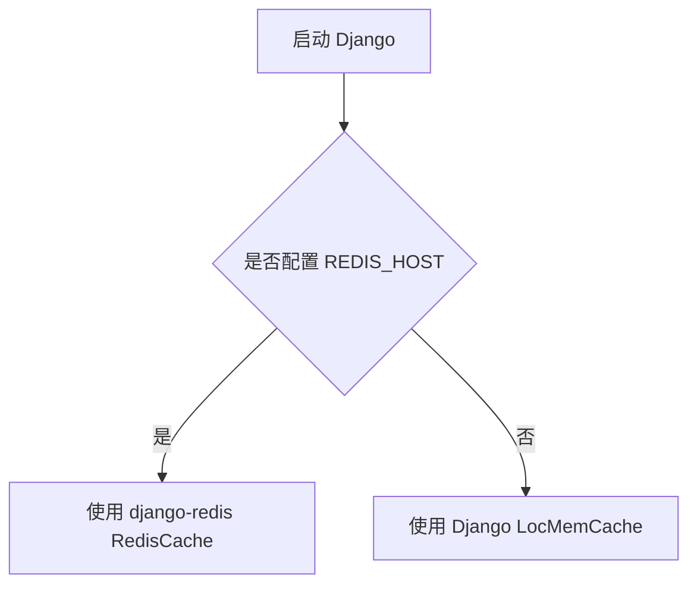

Redis 用途包括：

- 通用缓存。
- Session 存储。
- 后续可扩展任务状态、实时消息、生产监控数据缓存等。

---

## 6. URL 路由架构

### 6.1 主路由职责

主路由 `dtcall/urls.py` 承担四类职责：

1. 根路径和登录入口。
2. 各业务应用路由挂载。
3. JWT API 路由。
4. 历史路径兼容重定向。
5. 静态文件、媒体文件、临时文件开发模式映射。

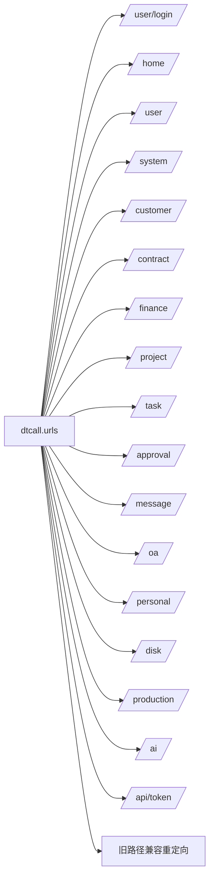

### 6.2 路由边界

| 应用 | 根路径 | 状态 |
|---|---|---|
| `user` | `/user/` | 已挂载 |
| `home` | `/home/` | 已挂载 |
| `oa` | `/oa/` | 已挂载 |
| `disk` | `/disk/` | 已挂载 |
| `customer` | `/customer/` | 已挂载 |
| `finance` | `/finance/` | 已挂载 |
| `production` | `/production/` | 已挂载 |
| `system` | `/system/` | 已挂载 |
| `personal` | `/personal/` | 已挂载 |
| `department` | `/system/department/` | 已挂载 |
| `contract` | `/contract/` | 已挂载 |
| `project` | `/project/` | 已挂载 |
| `task` | `/task/`、`/project/task/` | 已挂载 |
| `approval` | `/approval/` | 已挂载 |
| `message` | `/message/` | 已挂载 |
| `ai` | `/ai/` | 已挂载 |
| `inventory` | 未发现根路径挂载 | 已安装、有路由，需确认访问入口 |
| `enterprise` | 未发现根路径挂载 | 已安装、有模型，需确认访问入口 |
| `ai_orchestrator` | 未发现根路径挂载 | 侧车命令驱动为主 |

---

## 7. 前端架构

### 7.1 页面组织方式

前端模板统一位于：

```text
templates/
```

静态资源统一位于：

```text
static/
```

核心模板：

| 模板 | 作用 |
|---|---|
| `templates/home/base.html` | 后台主框架，包含顶部栏、左侧菜单、Tab 工作区、AI 数字人等 |
| `templates/home/main.html` | 后台入口页面，继承主框架 |
| `templates/home/iframe_base.html` | iframe 子页面基础模板，统一加载 LayUI、common.css、AI 主题等 |
| `templates/include/common.html` | 通用页面模板，包含 CSRF 和 LayUI messages 提示 |
| `templates/include/popup.html` | 弹窗页面模板，统一弹窗关闭和 CSRF |

### 7.2 主界面加载机制

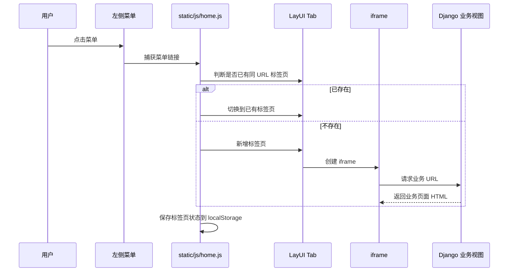

### 7.3 前端规范

1. 新增页面应优先继承已有基础模板。
2. 二级页面、详情页、新增页、编辑页应使用右侧弹出并占据右侧工作区 80% 的方式呈现。
3. 禁止在 `apps` 内创建模板目录，模板必须放在根目录 `templates`。
4. 不应随意引入新的前端技术栈破坏一致性。
5. 页面样式应复用 LayUI、`common.css`、已有模块样式和图标体系。
6. 新增 AJAX 请求必须处理 CSRF。
7. 菜单入口页面应适配 iframe 环境，避免强制顶层跳转。

### 7.4 前端资源结构

```text
static/
├── css/
│   ├── common.css
│   ├── ai-dynamic-theme.css
│   ├── workflow-designer.css
│   └── workflow-interaction.css
├── js/
│   ├── home.js
│   ├── common.js
│   ├── ai-agent-sdk.js
│   ├── workflow-designer.js
│   ├── workflow-interaction.js
│   ├── office_preview.js
│   └── lib/
│       ├── axios.min.js
│       └── vue.global.prod.js
├── layui/
├── img/
└── images/
```

---

## 8. 业务应用架构

### 8.1 平台基础层

| 应用 | 职责 |
|---|---|
| `user` | 用户、员工、认证、角色、权限、菜单、人事档案 |
| `department` | 组织架构、部门树、部门负责人 |
| `system` | 系统配置、菜单管理、日志、附件、备份、行政办公、存储配置、服务配置、中间件 |
| `common` | 基础模型、软删除、枚举、缓存、工具、通用服务 |
| `home` | 首页、主框架、统计看板、菜单聚合 |

### 8.2 经营业务层

| 应用 | 职责 |
|---|---|
| `customer` | 客户、联系人、跟进、订单、客户合同、客户发票、客户意向、动态字段 |
| `contract` | 合同分类、合同、产品、服务、供应商、采购资料 |
| `finance` | 报销、收入、发票、付款、开票申请、订单财务记录 |
| `project` | 项目、阶段、项目任务、工时、文档、评论 |
| `task` | 独立任务管理 |

### 8.3 协同办公层

| 应用 | 职责 |
|---|---|
| `approval` | 独立审批流程、审批类型、流程步骤、审批记录 |
| `message` | 消息分类、消息主体、用户消息关系、通知偏好 |
| `oa` | 会议室、会议记录、OA 消息、OA 审批、日程 |
| `personal` | 个人日程、工作记录、汇报、便签、个人任务、联系人、会议纪要 |
| `disk` | 企业网盘、文件夹、文件、分享、权限、操作日志 |

### 8.4 制造与供应链层

| 应用 | 职责 |
|---|---|
| `production` | 工序、工序集、工艺路线、BOM、设备、生产计划、生产任务、质检、数据采集、SOP、领退料、完工入库 |
| `inventory` | 仓库、库位、物料、库存、流水、入库、出库、调拨、盘点、采购订单、销售订单、预警、报表 |

### 8.5 智能能力层

| 应用 | 职责 |
|---|---|
| `ai` | AI 模型配置、工作流、节点、连接、执行记录、聊天、知识库、向量、RAG、意图识别、情绪分析、合规规则、反馈、批测、AI 任务 |
| `ai_orchestrator` | AI 编排侧车、后台命令、工作流引擎 |

---

## 9. 核心业务链路架构

### 9.1 客户到财务闭环

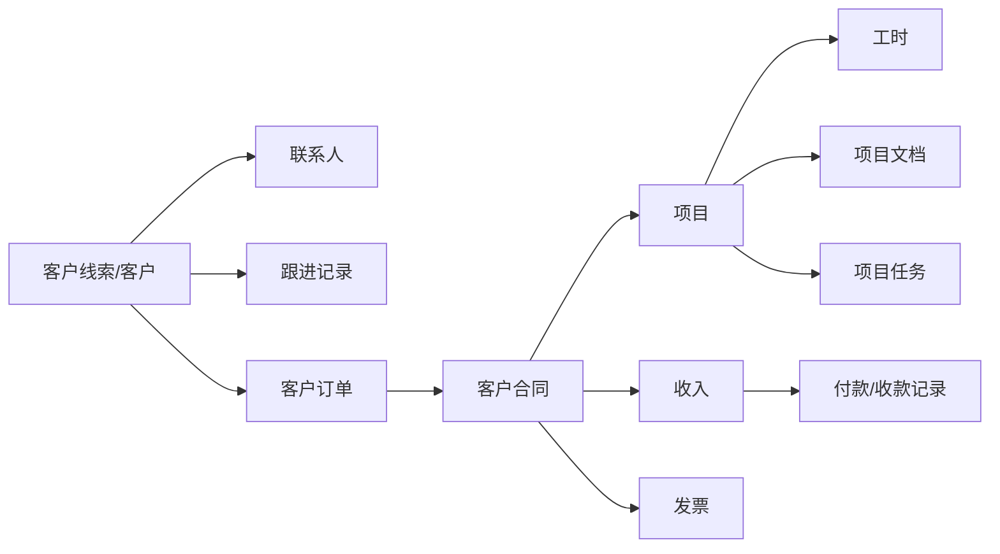

### 9.2 产品到生产库存闭环

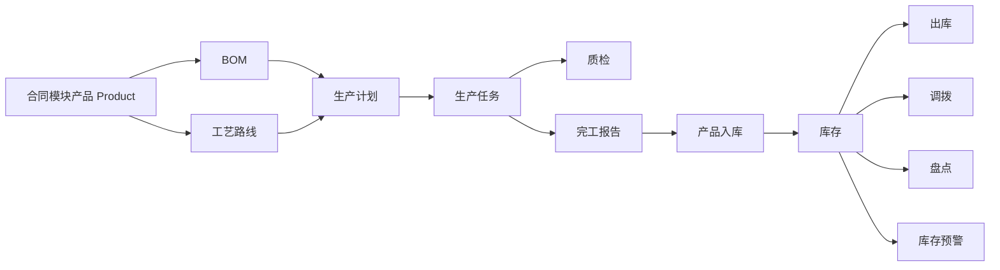

### 9.3 AI 横向赋能链路

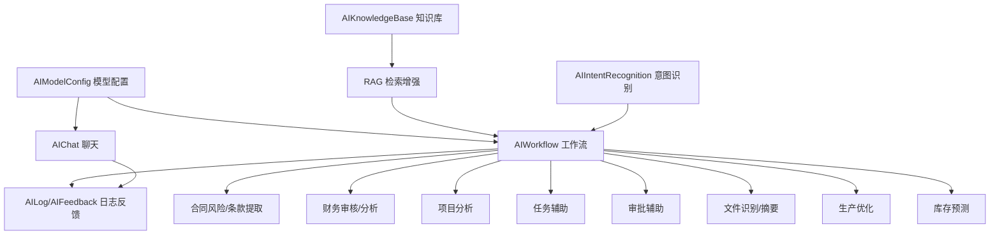

---

## 10. 数据模型关系架构

系统数据模型关系复杂，但核心依赖方向非常明确。

### 10.1 身份核心

`user.Admin` 是系统最核心模型，被大量模块作为：

- 登录账号。
- 员工档案主体。
- 创建人。
- 修改人。
- 负责人。
- 审批人。
- 消息发送人/接收人。
- 文件拥有者。
- 项目成员。
- 生产计划负责人。
- AI 工作流拥有者。

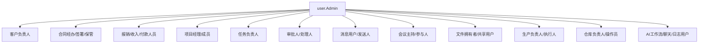

### 10.2 组织核心

`department.Department` 是多数业务模块使用的组织维度模型，用于：

- 部门负责人。
- 项目所属部门。
- 生产部门。
- 网盘共享部门。
- 公告目标部门。
- 公文目标部门。
- 个人工作记录部门。

---

## 11. AI 架构说明

### 11.1 AI 模块分层

| 层级 | 模型/服务 | 职责 |
|---|---|---|
| 模型配置层 | `AIModelConfig` | 管理 OpenAI、Azure、Anthropic、Gemini、文心、通义、混元、DeepSeek、豆包、Ollama、本地模型等配置 |
| 工作流建模层 | `AIWorkflow`、`WorkflowNode`、`WorkflowConnection`、`WorkflowVariable` | 定义 AI 工作流、节点、连线和变量 |
| 执行层 | `AIWorkflowExecution`、`NodeExecution`、增强工作流引擎 | 记录工作流执行状态、节点执行状态、异常和输出 |
| 知识层 | `AIKnowledgeBase`、`AIKnowledgeItem`、`AIKnowledgeVector` | 知识库、知识条目和向量数据 |
| 交互层 | `AIChat`、`AIChatMessage` | AI 聊天会话与消息 |
| 意图与策略层 | `AIIntentRecognition`、`AIEmotionAnalysis`、`AISalesStrategy` | 意图识别、情绪分析、销售策略 |
| 运营反馈层 | `AILog`、`AIFeedback`、`AIBatchTest` | 日志、反馈、批量测试 |

### 11.2 AI 接入原则

1. 业务模块不应直接硬编码模型 API Key。
2. 业务模块应通过 AI 模块统一模型配置、服务和工作流能力接入 AI。
3. AI 输出应保留日志和反馈，便于追踪与优化。
4. 涉及业务数据访问时，应受权限和数据范围控制。
5. AI 结果应作为辅助建议，不应绕过审批、权限、财务、生产等业务规则。

---

## 12. 部署架构

### 12.1 Docker Compose 架构

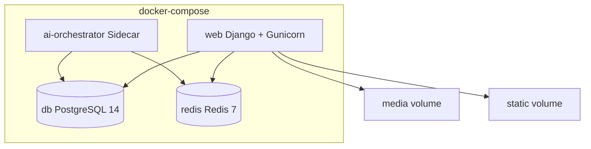

### 12.2 容器启动流程

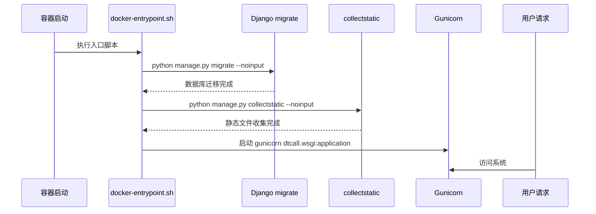

---

## 13. 安全架构

### 13.1 认证安全

- 使用自定义用户模型 `user.Admin`。
- 支持 Session 登录。
- 支持 JWT Token 获取、刷新、验证。
- 登录入口包含验证码。
- 用户权限兼容 Django Group/Permission，并有扩展模型。

### 13.2 权限安全

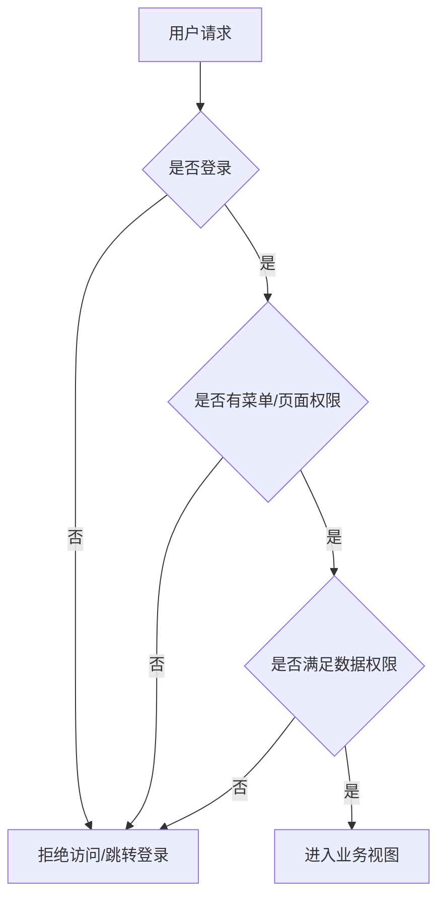

### 13.3 数据安全

1. 敏感配置必须使用环境变量或系统配置，不得硬编码。
2. 数据库密码、Redis 密码、云存储密钥、AI API Key 不应写入仓库。
3. 上传文件应限制类型、大小和访问权限。
4. 企业网盘分享应校验过期时间、权限范围和访问密码。
5. AI 读取业务数据时应遵循当前用户权限和数据权限。
6. 生产环境必须关闭 `DEBUG`。
7. `ALLOWED_HOSTS` 生产环境应显式配置可信域名。

---

## 14. 扩展开发规范

### 14.1 新增业务模块

新增业务模块应遵循：

```text
apps/new_module/
├── __init__.py
├── apps.py
├── models.py
├── views.py 或 views/
├── urls.py
├── forms.py
├── services.py 或 services/
└── migrations/
```

模板应放置在：

```text
templates/new_module/
```

静态资源应放置在：

```text
static/css/
static/js/
```

不得在 `apps/new_module/templates` 中创建模板。

### 14.2 新增模型

新增模型前必须确认：

1. 是否已有可复用模型。
2. 是否应关联 `user.Admin`。
3. 是否应关联 `department.Department`。
4. 是否需要软删除、创建时间、更新时间。
5. 是否需要数据权限字段。
6. 是否会与现有模型形成重复能力。
7. 是否需要接入审批、消息、附件、日志、AI。

### 14.3 新增页面

新增页面应确认：

1. 是否为主菜单页面。如果是，应适配 iframe Tab 工作区。
2. 是否为新增/编辑/详情页面。如果是，应优先右侧 80% 弹出。
3. 是否继承合适基础模板。
4. 是否复用 LayUI 表格、表单、弹窗和已有 CSS。
5. 是否处理 CSRF。
6. 是否需要菜单权限。
7. 是否需要数据权限过滤。

### 14.4 新增 AI 能力

新增 AI 能力应确认：

1. 是否已有 `apps.ai` 服务可复用。
2. 是否需要新增工作流节点。
3. 是否需要接入知识库和 RAG。
4. 是否需要记录 AI 日志。
5. 是否需要反馈和批测。
6. 是否需要业务权限控制。
7. 是否需要脱敏或限制敏感数据。

---

## 15. 架构风险与治理建议

| 风险 | 影响 | 建议 |
|---|---|---|
| 部门模型并存 | 组织数据可能割裂 | 明确 `department.Department` 为主组织模型，并逐步治理历史引用 |
| 任务模型并存 | 项目任务和独立任务边界模糊 | 通过文档和服务边界明确使用场景 |
| 审批模型并存 | 通用审批与 OA 审批可能重复 | 后续统一审批中台或明确双轨边界 |
| 旧路径大量存在 | 路由复杂，迁移容易破坏历史链接 | 路由重构必须保留兼容映射 |
| 前端页面风格不完全统一 | 用户体验不一致 | 新页面严格遵循 LayUI 与右侧弹层规范 |
| AI 模块横向扩张 | 容易绕过业务权限 | AI 服务必须统一接入权限、日志、数据范围控制 |
| 库存已安装但未挂根路由 | 页面可达性不明确 | 根据产品规划确认是否补充 `/inventory/` 根路由 |
| 生产监控依赖 channels 但配置不完整 | 实时能力可能受限 | 若启用 WebSocket/Channel Layer，应补齐 ASGI 与 CHANNEL_LAYERS 配置 |

---

## 16. 总结

DT 企业智能管理系统本质上是一个大型 Django 企业管理单体应用。它通过 `apps` 进行业务域模块化拆分，通过 `user.Admin`、`department.Department`、`customer.Customer`、`contract.Product`、`ai.AIWorkflow` 等关键模型建立横向业务联系，通过 LayUI + iframe Tab 提供统一后台体验，通过 PostgreSQL、Redis、云存储和 Docker 提供生产运行基础。

后续任何功能开发都应遵循以下原则：

1. 先查已有模型和服务，避免重复建设。
2. 先明确业务归属，避免功能孤岛。
3. 优先复用平台能力，包括权限、消息、审批、附件、日志、AI。
4. 前端保持统一模板、统一样式、统一弹窗交互。
5. 敏感配置绝不硬编码。
6. 数据权限和菜单权限必须贯穿所有业务入口。
7. 涉及 AI 的能力必须可追踪、可审计、可控权。
