# DT企业智能管理系统架构图合集

> 本文档集中展示 DT 企业智能管理系统的核心架构图、业务链路图、部署图、权限流程图、AI 能力图和数据关系图。
> 图表使用 Mermaid 编写，可在支持 Mermaid 的 Markdown 查看器中直接渲染。
> 如果只想快速理解整个项目，建议优先阅读本文档。

***

## 1. 系统上下文图

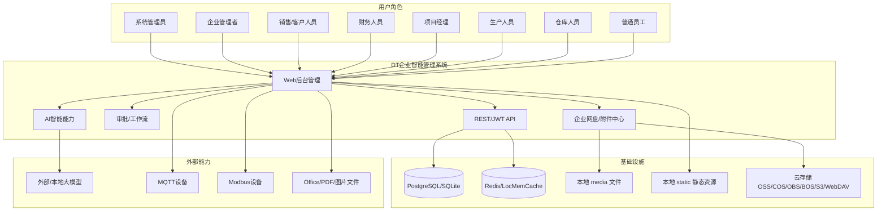

系统服务多类企业角色，核心能力运行在同一个 Django 后台系统中。数据持久化主要依赖关系数据库；缓存和会话优先使用 Redis；文件可存储在本地或云存储；AI 能力通过模型配置、知识库和工作流连接外部或本地大模型；生产模块可连接工业采集协议。

***

## 2. 应用分层架构图

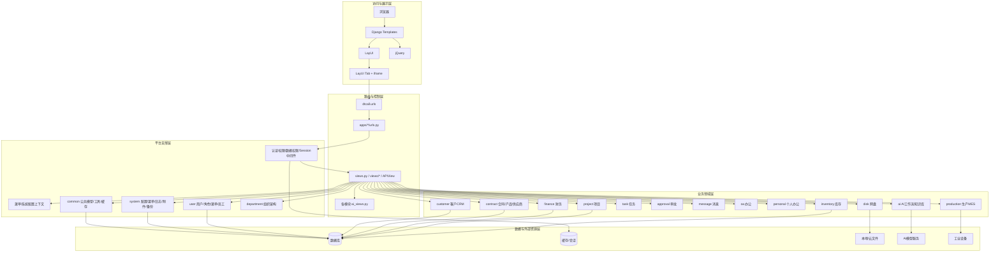

***

## 3. 项目目录结构图

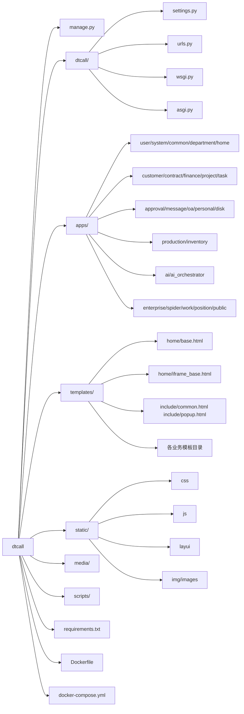

***

## 4. 主请求链路图

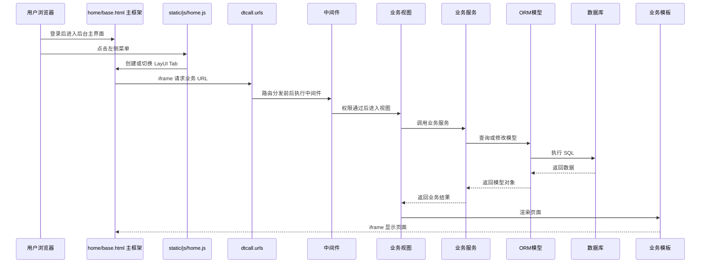

***

## 5. 前端页面结构图

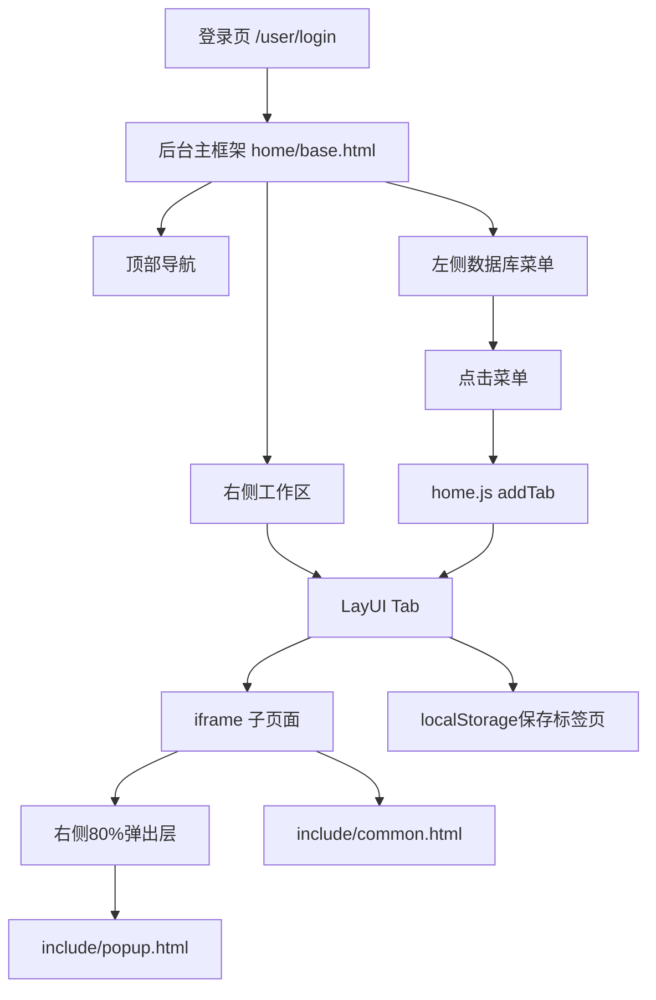

***

## 6. 路由挂载图

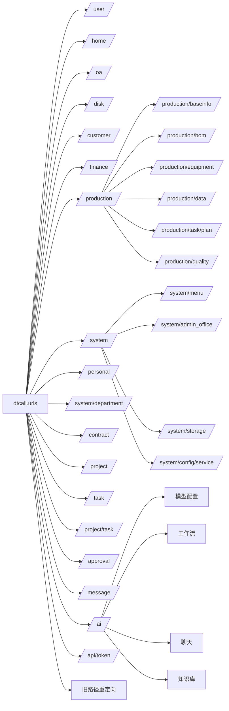

***

## 7. 业务能力地图

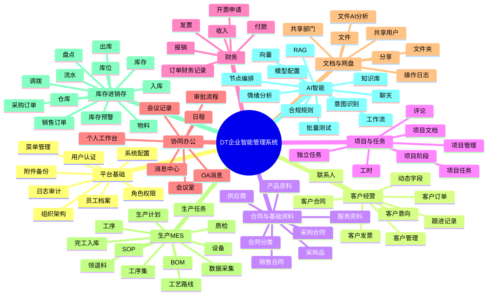

***

## 8. 业务闭环链路图

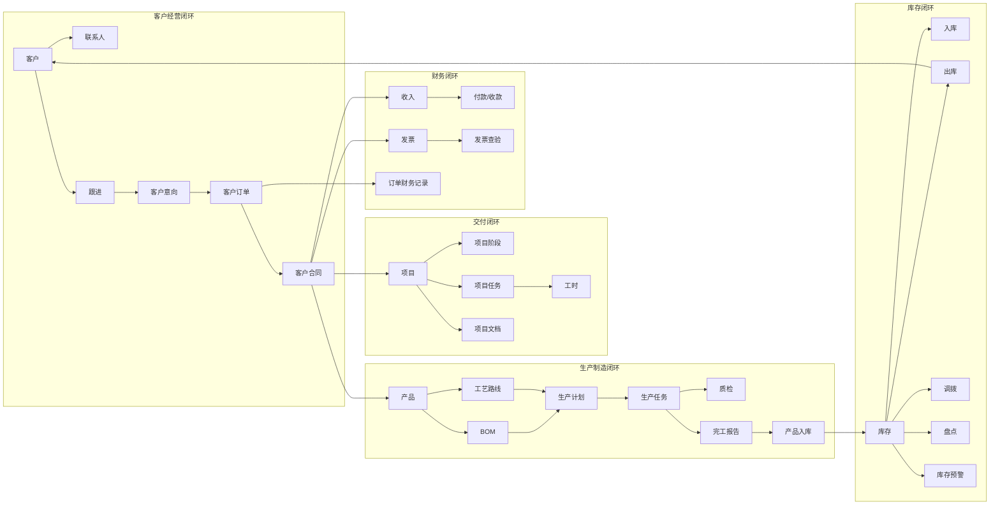

***

## 9. 核心数据关系图

```mermaid
erDiagram
    ADMIN ||--o{ CUSTOMER : principal
    ADMIN ||--o{ PROJECT : manager
    ADMIN ||--o{ TASK : assignee
    ADMIN ||--o{ MESSAGE : sender
    ADMIN ||--o{ DISK_FILE : owner
    ADMIN ||--o{ AI_WORKFLOW : owner

    DEPARTMENT ||--o{ PROJECT : belongs_to
    DEPARTMENT ||--o{ PRODUCTION_PLAN : production_department
    DEPARTMENT ||--o{ DISK_FOLDER : shared_department

    CUSTOMER ||--o{ CONTACT : has
    CUSTOMER ||--o{ FOLLOW_RECORD : has
    CUSTOMER ||--o{ CUSTOMER_ORDER : has
    CUSTOMER ||--o{ CUSTOMER_CONTRACT : has
    CUSTOMER ||--o{ CUSTOMER_INVOICE : has
    CUSTOMER ||--o{ PROJECT : creates

    CUSTOMER_CONTRACT ||--o{ PROJECT : related_contract
    CUSTOMER_ORDER ||--o{ ORDER_FINANCE_RECORD : finance_record

    CONTRACT_PRODUCT ||--o{ BOM : product
    CONTRACT_PRODUCT ||--o{ PROCESS_ROUTE : product
    CONTRACT_PRODUCT ||--o{ PRODUCTION_PLAN : product

    BOM ||--o{ BOM_ITEM : contains
    PROCESS_ROUTE ||--o{ PROCESS_ROUTE_ITEM : contains
    PRODUCTION_PLAN ||--o{ PRODUCTION_TASK : generates
    PRODUCTION_TASK ||--o{ QUALITY_CHECK : checked_by
    PRODUCTION_TASK ||--o{ WORK_COMPLETION_REPORT : completes

    WAREHOUSE ||--o{ WAREHOUSE_LOCATION : contains
    INVENTORY_ITEM ||--o{ INVENTORY : stock
    INVENTORY ||--o{ STOCK_TRANSACTION : changes
    STOCK_IN ||--o{ STOCK_IN_ITEM : contains
    STOCK_OUT ||--o{ STOCK_OUT_ITEM : contains
    STOCK_TRANSFER ||--o{ STOCK_TRANSFER_ITEM : contains
    STOCK_CHECK ||--o{ STOCK_CHECK_ITEM : contains

    AI_WORKFLOW ||--o{ WORKFLOW_NODE : contains
    AI_WORKFLOW ||--o{ WORKFLOW_CONNECTION : contains
    AI_WORKFLOW ||--o{ AI_WORKFLOW_EXECUTION : executes
    AI_KNOWLEDGE_BASE ||--o{ AI_KNOWLEDGE_ITEM : contains
    AI_KNOWLEDGE_ITEM ||--o{ AI_KNOWLEDGE_VECTOR : vectorizes
```

***

## 10. 用户、权限、菜单流程图

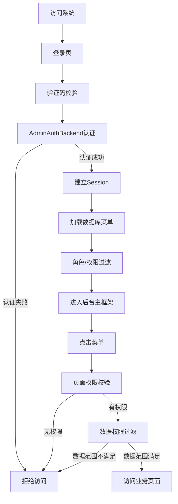

***

## 11. 客户 CRM 业务结构图

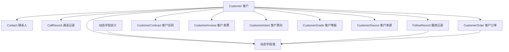

***

## 12. 合同、项目、财务集成图

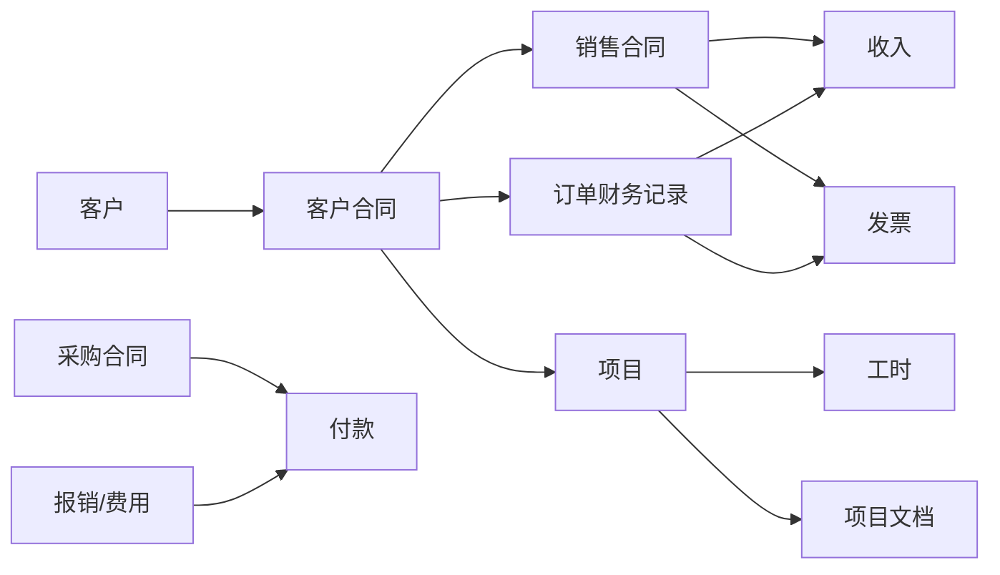

***

## 13. 生产 MES 结构图

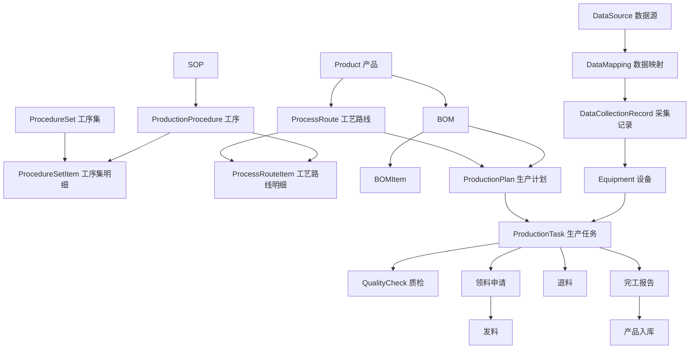

***

## 14. 库存进销存结构图

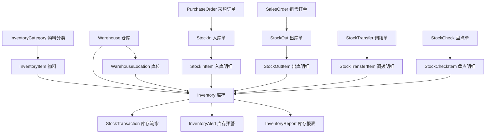

***

## 15. 企业网盘权限结构图

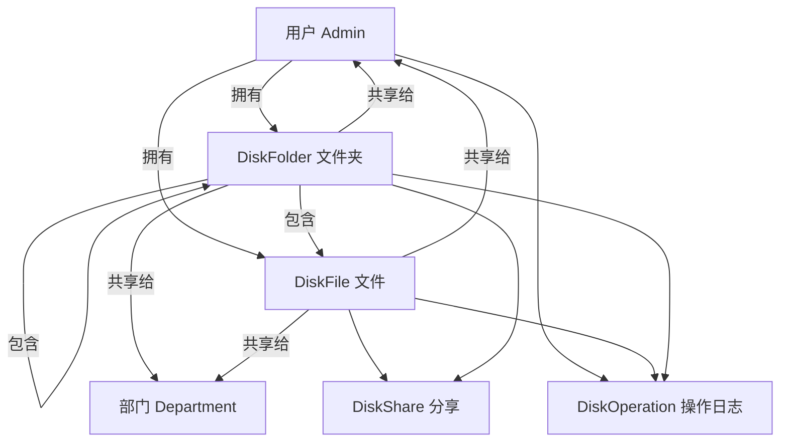

***

## 16. AI 能力架构图

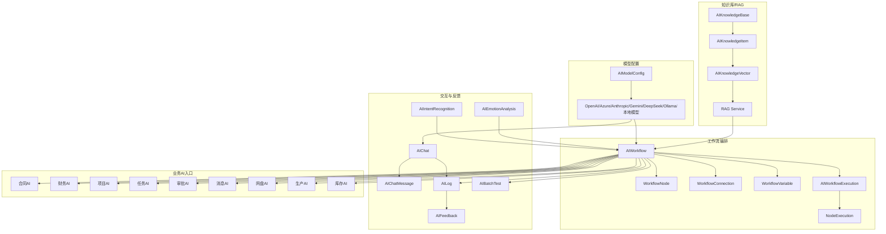

***

## 17. 审批与消息协同图

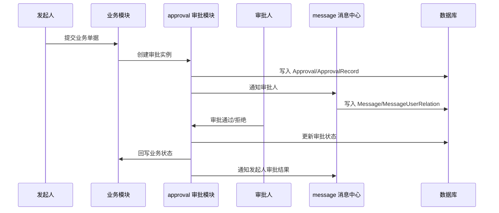

***

## 18. 部署拓扑图

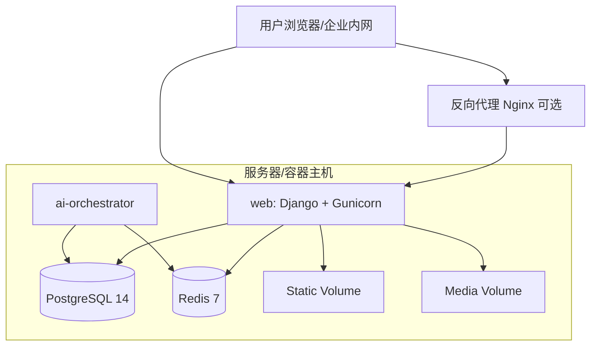

***

## 19. 容器启动流程图

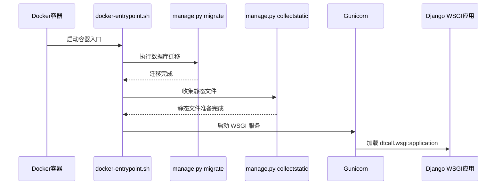

***

## 20. 数据库与缓存选择流程图

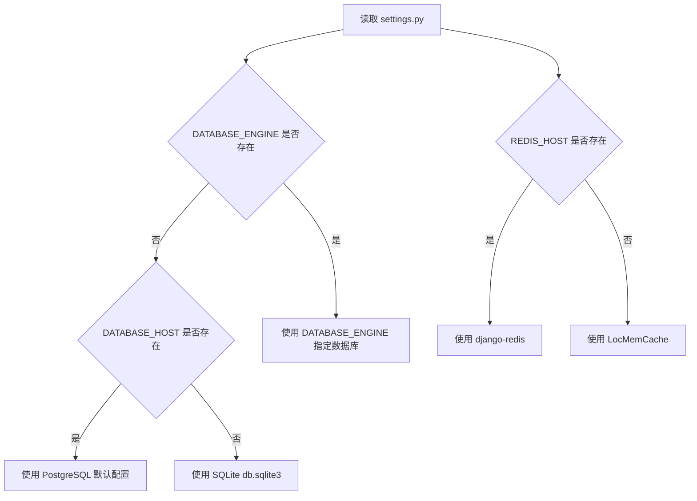

***

## 21. 模块依赖总览图

```mermaid
flowchart TB
    User[user.Admin 用户核心]
    Department[department.Department 组织核心]
    Common[common 公共能力]
    System[system 系统平台]

    Customer[customer]
    Contract[contract]
    Finance[finance]
    Project[project]
    Task[task]
    Approval[approval]
    Message[message]
    OA[oa]
    Personal[personal]
    Disk[disk]
    Production[production]
    Inventory[inventory]
    AI[ai]

    User --> Customer
    User --> Contract
    User --> Finance
    User --> Project
    User --> Task
    User --> Approval
    User --> Message
    User --> OA
    User --> Personal
    User --> Disk
    User --> Production
    User --> Inventory
    User --> AI

    Department --> Project
    Department --> Disk
    Department --> Production
    Department --> Personal
    Department --> System

    Common --> Customer
    Common --> Contract
    Common --> Finance
    Common --> Project
    Common --> System
    Common --> OA

    System --> User
    System --> Message

    Customer --> Contract
    Customer --> Project
    Customer --> Finance
    Contract --> Production
    Contract --> Inventory
    Project --> Task
    Production --> Inventory

    AI --> Contract
    AI --> Finance
    AI --> Project
    AI --> Task
    AI --> Approval
    AI --> Message
    AI --> Disk
    AI --> Production
    AI --> Inventory
```

***

## 22. 读图结论

通过以上图可以快速得到以下结论：

1. 系统是 Django 单体模块化架构，不是微服务，也不是前后端分离工程。
2. `user.Admin` 是身份与权限核心，几乎所有业务模型都直接或间接关联它。
3. `department.Department` 是多数业务使用的组织维度核心。
4. 客户、合同、项目、财务构成经营交付链路。
5. 产品、BOM、工艺、生产计划、生产任务、完工入库、库存构成制造供应链链路。
6. 审批、消息、网盘、个人办公、OA 是横向协同能力。
7. AI 模块不是单一聊天工具，而是横向智能能力平台，支撑多个业务域的分析、预测、摘要、识别和工作流编排。
8. 部署上推荐 PostgreSQL + Redis + Gunicorn + Docker Compose，AI Orchestrator 作为侧车进程运行。

