# DT企业智能管理系统业务模块与数据模型说明

> 文档位置：`documents/04_业务模块与数据模型说明.md`
> 适用对象：后端开发、数据开发、测试、实施、产品经理、项目经理
> 文档目标：从业务模块、核心数据模型、跨模块关系、数据流转和边界风险角度解释整个项目，让读者能够快速判断每个模块负责什么、数据如何关联、后续开发应该复用哪些对象。

---

## 1. 文档阅读说明

本说明以项目源码中的 Django 应用结构为基础，围绕 `apps/` 下各业务模块展开。由于项目采用多应用模块化架构，很多业务能力通过外键、多对多、服务层和路由进行串联，阅读时建议遵循以下顺序：

1. 先看“全局业务数据地图”，理解系统主数据和业务闭环。
2. 再看“核心模型总览”，记住全项目最常被引用的基础对象。
3. 之后按模块查看职责、模型、关系和边界。
4. 最后看“跨模块数据链路”和“数据治理风险”，用于指导后续开发和测试。

---

## 2. 全局业务数据地图

DT 企业智能管理系统的数据结构可以理解为“身份组织 + 业务经营 + 协同支撑 + 生产库存 + AI 增强”的组合。

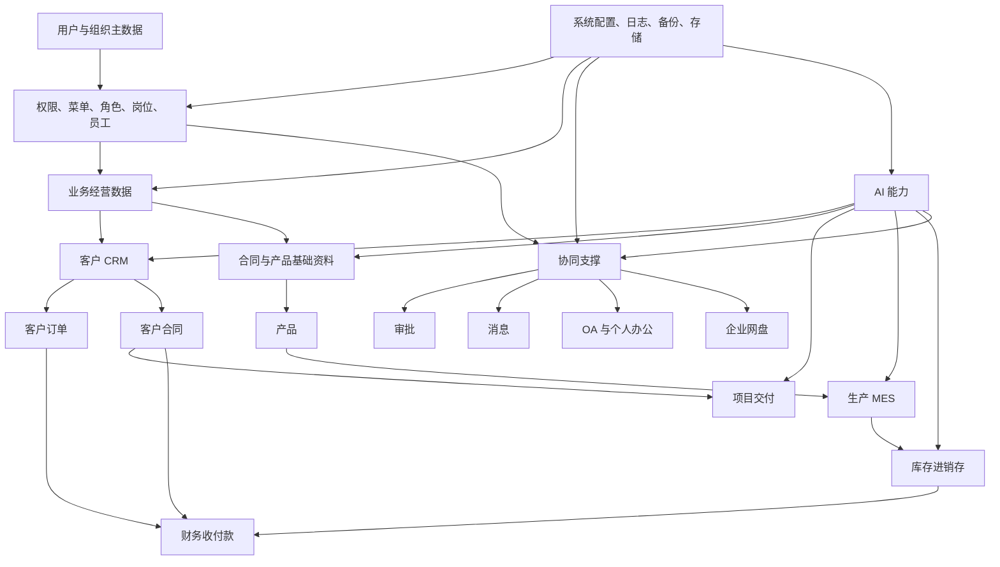

核心理解：

| 数据层级 | 代表模块 | 主要价值 |
|---|---|---|
| 身份组织层 | `user`、`department`、`position`、`system` | 决定谁能登录、能看到哪些菜单、能操作哪些数据 |
| 经营业务层 | `customer`、`contract`、`finance`、`project`、`task` | 覆盖客户、合同、项目、财务和任务协作 |
| 制造供应链层 | `production`、`inventory`、`contract.Product`、`contract.Supplier` | 覆盖产品、生产计划、物料、库存、采购和销售流转 |
| 协同办公层 | `approval`、`message`、`oa`、`personal`、`disk` | 支撑流程审批、消息通知、办公日程、文件协作 |
| 智能能力层 | `ai`、`ai_orchestrator` | 为业务分析、知识问答、工作流编排和智能助手提供能力 |
| 平台治理层 | `system`、`common`、`scripts`、部署配置 | 支撑配置、日志、备份、通用模型、运维脚本和安全治理 |

---

## 3. 全项目最重要的核心模型

### 3.1 核心模型列表

| 核心模型 | 所属模块 | 角色定位 | 典型关联方向 |
|---|---|---|---|
| `Admin` | `apps.user` | 全局用户身份模型 | 创建人、负责人、审批人、接收人、文件拥有者、AI 工作流拥有者 |
| `Department` | `apps.department` | 企业组织架构主数据 | 员工归属、项目归属、生产部门、公告目标、网盘共享 |
| `Customer` | `apps.customer` | 客户经营主实体 | 联系人、跟进、订单、合同、发票、项目、财务 |
| `CustomerContract` | `apps.customer` | 客户侧合同数据 | 客户、订单、项目、财务、收入、发票 |
| `Product` | `apps.contract` | 产品基础资料 | BOM、生产计划、库存物料、销售与采购链路 |
| `ProductionPlan` | `apps.production` | 生产计划主实体 | 产品、BOM、工艺路线、任务、领料、完工、入库 |
| `InventoryItem` | `apps.inventory` | 库存物料主数据 | 库存、出入库、调拨、盘点、采购、销售、预警 |
| `AIModelConfig` | `apps.ai` | AI 模型接入配置 | 聊天、工作流、RAG、业务分析 |
| `AIWorkflow` | `apps.ai` | AI 工作流主实体 | 节点、连接、执行记录、业务工具调用 |
| `Message` | `apps.message` | 消息通知主实体 | 用户消息、系统通知、业务提醒、审批通知 |

### 3.2 核心模型关系示意

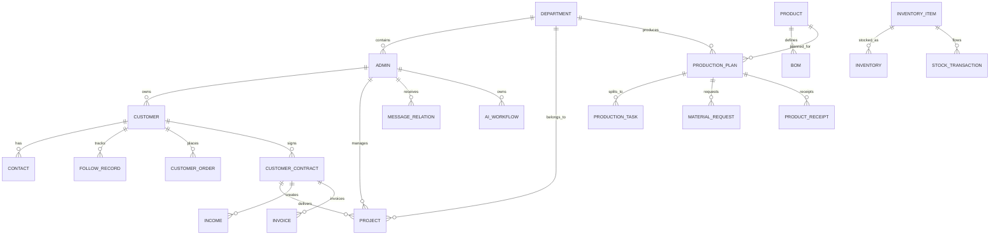

### 3.3 模型复用原则

后续新增功能时，应优先复用以下模型，不应重复创建同类主数据：

| 业务需求 | 优先复用模型 | 不建议做法 |
|---|---|---|
| 新增负责人、创建人、审核人字段 | `settings.AUTH_USER_MODEL` 或 `user.Admin` | 新建独立用户表 |
| 新增部门归属 | `department.Department` | 新建业务专属部门表 |
| 新增客户相关业务 | `customer.Customer` | 在其他模块重复维护客户名称和联系方式 |
| 新增产品、物料、生产对象 | 先确认 `contract.Product` 与 `inventory.InventoryItem` 边界 | 在生产模块复制产品主数据 |
| 新增合同、订单、收付款链路 | 复用 `customer.CustomerContract`、`CustomerOrder`、`finance` 模型 | 新建孤立财务流水表 |
| 新增审批流 | 优先评估 `approval` 通用审批 | 在业务模块内重复开发审批模型 |
| 新增通知提醒 | 复用 `message` 服务和消息模型 | 在业务表中硬编码通知字段 |
| 新增 AI 分析功能 | 复用 `ai` 模型配置、工作流、服务层 | 在业务模块直接散落第三方模型调用 |

---

## 4. 模块职责总览

| 应用 | 业务职责 | 数据类型 | 是否核心业务链路 |
|---|---|---|---|
| `user` | 登录、员工、用户、角色、菜单、人事档案 | 身份与权限数据 | 是 |
| `department` | 企业部门组织树 | 组织主数据 | 是 |
| `position` | 岗位相关页面与表单 | 人事基础数据 | 是 |
| `system` | 系统配置、菜单、日志、备份、附件、存储、行政办公配置 | 平台治理数据 | 是 |
| `common` | 通用基类、枚举、工具、缓存、公共能力 | 基础抽象数据 | 是 |
| `customer` | 客户、联系人、跟进、订单、客户合同、客户发票、意向 | CRM 经营数据 | 是 |
| `contract` | 合同、产品、产品分类、服务、供应商、采购销售合同 | 合同与基础资料 | 是 |
| `finance` | 报销、收入、发票、付款、开票申请、订单财务记录 | 财务数据 | 是 |
| `project` | 项目、阶段、项目任务、工时、文档、评论 | 项目交付数据 | 是 |
| `task` | 独立任务协同 | 协作数据 | 中 |
| `approval` | 通用审批、审批记录、审批类型、审批流程、审批步骤 | 流程数据 | 是 |
| `message` | 消息分类、消息、用户消息关系、通知偏好 | 通知数据 | 是 |
| `oa` | 会议、OA 消息、OA 审批、日程 | 办公数据 | 中 |
| `personal` | 个人日程、工作记录、汇报、便签、联系人、会议纪要 | 个人办公数据 | 中 |
| `disk` | 企业网盘、文件夹、文件、分享、操作日志 | 文件协同数据 | 是 |
| `production` | 工序、工艺路线、BOM、设备、生产计划、任务、质检、采集、完工 | 生产制造数据 | 是 |
| `inventory` | 仓库、库位、物料、库存、出入库、调拨、盘点、采购、销售、预警 | 库存供应链数据 | 是 |
| `ai` | 模型配置、工作流、节点、知识库、聊天、RAG、意图识别、反馈 | AI 能力数据 | 是 |
| `ai_orchestrator` | AI 编排侧车进程、工作流执行支撑 | 后台编排数据 | 中 |
| `enterprise` | 企业信息相关模型 | 企业主数据 | 需确认 |
| `public` | 公共企业模型等 | 公共数据 | 需确认 |
| `spider` | 爬虫任务与采集相关能力 | 数据采集 | 中 |
| `work` | 工作相关辅助能力 | 协作数据 | 中 |

---

## 5. 用户、权限与组织模块

### 5.1 模块组成

| 模块 | 主要职责 |
|---|---|
| `apps.user` | 用户登录、退出、员工管理、角色组、菜单、部门兼容路由、人事档案 |
| `apps.department` | 企业部门组织树、部门负责人、父子结构 |
| `apps.position` | 岗位页面、岗位表单、岗位相关视图 |
| `apps.system` | 菜单、系统配置、权限中间件、上下文处理器、系统日志 |

### 5.2 用户身份模型

项目使用自定义用户模型 `user.Admin`，并在 Django 配置中通过 `AUTH_USER_MODEL = 'user.Admin'` 指定。该模型继承 Django `AbstractUser`，并扩展员工、人事、部门和权限相关字段。

核心特点：

| 特点 | 说明 |
|---|---|
| 登录账号 | 使用 `username` 作为 `USERNAME_FIELD` |
| 权限体系 | 仍兼容 Django `Group` 与 `Permission`，但使用自定义 related name 避免冲突 |
| 部门关系 | 存在主部门、次要部门等组织关系字段 |
| 项目全局引用 | 多数业务模块通过 `settings.AUTH_USER_MODEL` 或 `'user.Admin'` 关联用户 |

### 5.3 部门模型

`apps.department.Department` 是当前多数业务模块使用的部门主模型。

主要字段语义：

| 字段/关系 | 作用 |
|---|---|
| `name` | 部门名称 |
| `pid` | 上级部门 ID，用于组织树 |
| `manager` | 部门负责人，关联 `user.Admin` |
| 业务外键引用 | 项目、生产、网盘、公告、消息等模块通过部门实现组织维度管理 |

### 5.4 权限与菜单链路

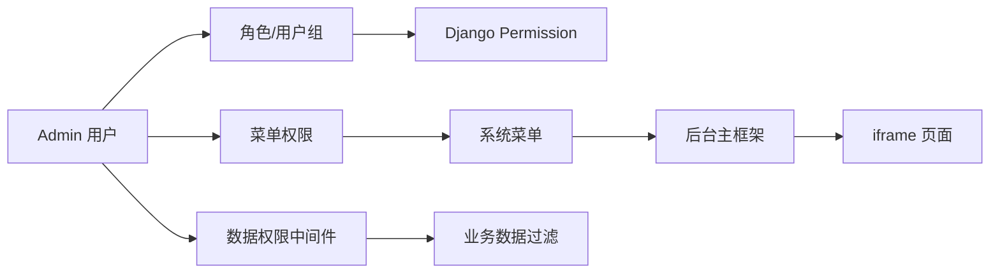

权限理解：

1. 用户登录后进入后台主框架。
2. 菜单通过系统上下文处理器和权限逻辑输出到模板。
3. 菜单点击后通过 LayUI Tab + iframe 加载业务页面。
4. 业务页面请求后端视图时，权限和数据权限中间件控制可访问范围。
5. 业务模块不应绕过平台权限机制直接暴露数据。

### 5.5 开发注意事项

| 场景 | 建议 |
|---|---|
| 新增业务负责人字段 | 使用 `settings.AUTH_USER_MODEL`，提高可维护性 |
| 新增部门字段 | 优先关联 `apps.department.Department` |
| 新增菜单 | 应接入系统菜单管理，不应硬编码到模板中 |
| 新增页面权限 | 同步考虑菜单可见性、接口访问权限和数据权限 |
| 新增员工扩展信息 | 优先检查 `apps.user` 已有人事档案字段和关联模型 |

---

## 6. 系统管理与公共能力模块

### 6.1 `system` 模块职责

`system` 模块是平台治理中心，承担以下职责：

| 能力 | 说明 |
|---|---|
| 系统配置 | 保存平台级参数、服务配置、存储配置等 |
| 菜单管理 | 管理后台菜单结构和权限入口 |
| 日志管理 | 记录操作日志、系统日志等 |
| 附件管理 | 对上传附件进行统一管理 |
| 备份与恢复 | 提供备份策略、备份记录、恢复入口 |
| 行政办公 | 行政办公相关通知、文件、印章等能力 |
| 存储配置 | 本地存储和云存储服务配置 |
| 上下文处理器 | 向模板注入菜单、系统配置等全局上下文 |

### 6.2 `common` 模块职责

`common` 模块提供项目公共抽象能力。

| 公共对象 | 作用 |
|---|---|
| `BaseModel` | 统一 `created_at`、`updated_at` 时间字段 |
| `SoftDeleteModel` | 提供软删除字段，如 `deleted_at`、`is_deleted` |
| 公共枚举 | 统一业务状态、类型、选择项 |
| 公共工具 | 缓存、工具函数、通用服务支撑 |

### 6.3 公共模型复用建议

| 新增模型需求 | 建议 |
|---|---|
| 需要创建和更新时间 | 继承或参考 `BaseModel` 的字段规范 |
| 需要软删除 | 使用或参考 `SoftDeleteModel`，避免物理删除导致业务链断裂 |
| 需要状态枚举 | 优先放入公共枚举或模块内统一 choices，不要散落字符串 |
| 需要跨模块服务 | 放在公共服务或对应领域服务中，避免视图层直接堆逻辑 |

---

## 7. 客户 CRM 模块

### 7.1 模块定位

`customer` 是业务经营链路的起点，用于管理客户、联系人、跟进记录、客户意向、客户订单、客户合同和客户发票。

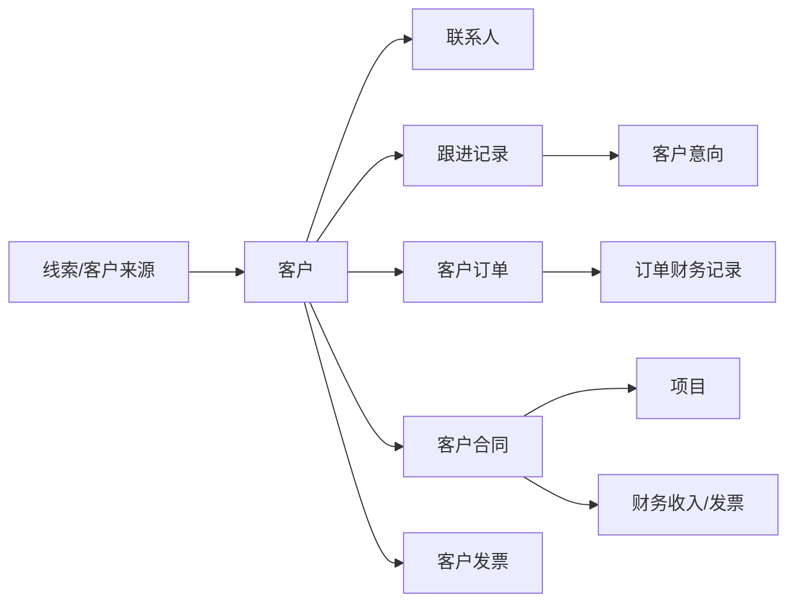

### 7.2 核心模型

| 模型 | 业务含义 | 典型关系 |
|---|---|---|
| `Customer` | 客户主数据 | 关联联系人、跟进、订单、合同、发票 |
| `Contact` | 客户联系人 | 归属于客户 |
| `FollowRecord` | 客户跟进记录 | 归属于客户，可扩展自定义字段 |
| `CustomerIntent` | 客户意向 | 来自跟进或商机识别 |
| `CustomerOrder` | 客户订单 | 关联客户，可进入财务记录 |
| `CustomerContract` | 客户合同 | 关联客户，可进入项目和财务 |
| `CustomerInvoice` | 客户发票 | 关联客户或业务单据 |
| `CustomerGrade` | 客户等级 | 客户分层管理 |
| `CustomerSource` | 客户来源 | 线索渠道管理 |
| `CustomerField` | 客户自定义字段定义 | 支撑动态扩展 |
| `CustomerCustomFieldValue` | 客户自定义字段值 | 保存客户扩展字段数据 |
| `FollowField` | 跟进自定义字段定义 | 支撑跟进扩展 |
| `OrderField` | 订单自定义字段定义 | 支撑订单扩展 |
| `SpiderTask` | 客户采集任务 | 支撑爬虫或外部数据采集 |
| `CallRecord` | 通话记录 | 支撑客户沟通留痕 |

### 7.3 关键数据链路

| 起点 | 流转 | 结果 |
|---|---|---|
| 客户来源 | 创建客户 | 形成客户主数据 |
| 客户 | 添加联系人 | 建立沟通对象 |
| 客户 | 记录跟进 | 形成销售过程记录 |
| 跟进 | 产生意向 | 进入商机推进 |
| 客户 | 创建订单 | 进入成交与财务链路 |
| 客户 | 创建客户合同 | 进入履约、项目和收款链路 |
| 客户合同 | 创建项目 | 进入交付管理 |
| 客户订单/合同 | 生成财务记录 | 进入收入、发票、付款管理 |

### 7.4 测试关注点

| 关注点 | 验证内容 |
|---|---|
| 客户主数据 | 客户创建、编辑、删除、查询、分级、来源是否正确 |
| 联系人 | 一个客户多个联系人是否正常 |
| 跟进记录 | 跟进时间、负责人、内容、附件、自定义字段是否保存正确 |
| 订单链路 | 订单是否能关联客户并进入财务统计 |
| 合同链路 | 客户合同是否能被项目和财务引用 |
| 权限 | 不同用户是否只能看到授权客户或部门客户 |

---

## 8. 合同、产品、供应商模块

### 8.1 模块定位

`contract` 模块承担合同管理和经营基础资料管理职责，其中 `Product` 对生产模块非常关键，`Supplier` 对库存采购链路非常关键。

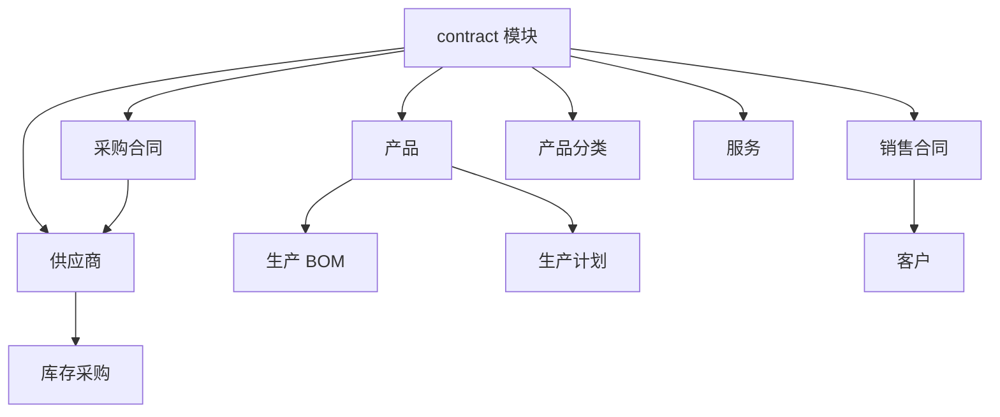

### 8.2 核心模型和职责

| 模型/对象 | 业务含义 | 下游依赖 |
|---|---|---|
| `Product` | 产品基础资料，包含产品编码、分类、管理员等 | 生产 BOM、生产计划、库存物料映射 |
| `ProductCate` | 产品分类 | 产品管理、统计分析 |
| `Supplier` | 供应商主数据 | 采购合同、库存采购订单、入库 |
| 销售合同相关模型 | 销售合同业务 | 客户、财务、项目 |
| 采购合同相关模型 | 采购合同业务 | 供应商、库存、财务 |
| 服务相关模型 | 服务项目与服务合同基础资料 | 合同与客户服务场景 |

### 8.3 产品与生产关系

`Product` 是生产模块中的核心外部依赖。生产计划、BOM、工艺等都围绕产品展开。

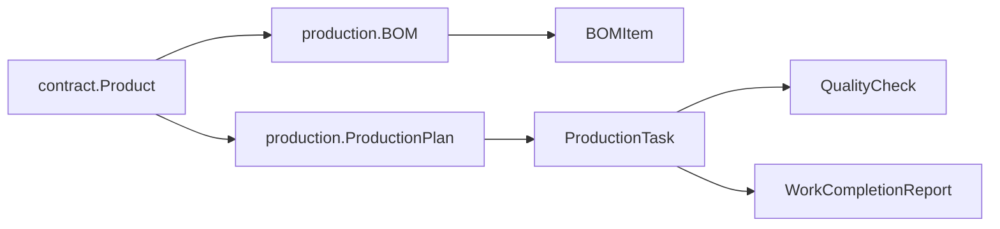

### 8.4 AI 合同能力

合同模块存在 AI 风险分析、条款抽取等接口入口，属于业务 AI 的典型落点。

| 能力 | 价值 |
|---|---|
| 合同风险分析 | 辅助识别合同条款中的风险、缺失项、异常条件 |
| 合同条款抽取 | 从合同文本中抽取关键条款、金额、期限、责任等信息 |
| 合同归档辅助 | 为合同摘要、标签、分类、检索提供智能支持 |

### 8.5 开发注意事项

| 场景 | 建议 |
|---|---|
| 新增产品字段 | 先确认是否会影响生产、库存、销售统计 |
| 新增供应商字段 | 同步考虑采购订单、入库、合同引用 |
| 新增合同 AI 能力 | 复用 `apps.ai` 的模型配置和服务，不应在合同模块硬编码密钥 |
| 新增合同页面 | 遵循右侧 80% 弹层打开详情、新增、编辑页面 |

---

## 9. 财务模块

### 9.1 模块定位

`finance` 模块负责企业经营过程中的费用、收入、发票、付款、开票申请和订单财务记录，是业务闭环中的资金与票据中心。

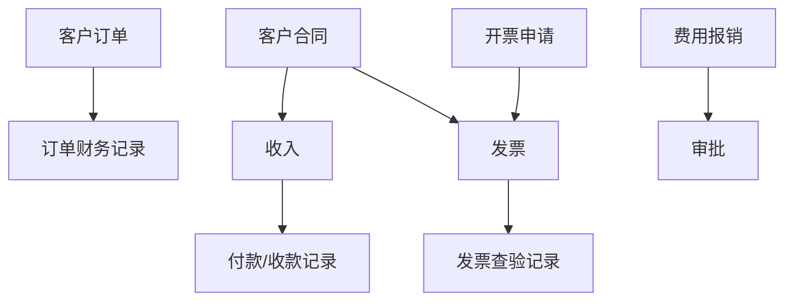

### 9.2 核心模型

| 模型 | 业务含义 | 关联建议 |
|---|---|---|
| `Expense` | 费用、报销、支出类数据 | 可与审批、部门、用户关联 |
| `Income` | 收入记录 | 可关联客户合同、客户、项目 |
| `Invoice` | 发票数据 | 可关联客户、合同、收入、开票申请 |
| `Payment` | 付款或收款记录 | 可关联收入、合同、供应商、客户 |
| `InvoiceRequest` | 开票申请 | 可进入审批流程和发票生成 |
| `InvoiceVerifyRecord` | 发票查验记录 | 保存发票查验结果和状态 |
| `OrderFinanceRecord` | 订单财务记录 | 连接客户订单与财务统计 |

### 9.3 财务数据流

| 业务来源 | 财务动作 | 输出数据 |
|---|---|---|
| 客户订单 | 生成订单财务记录 | 订单金额、收款状态、应收统计 |
| 客户合同 | 登记收入 | 合同收入、回款计划、应收账款 |
| 开票申请 | 生成发票 | 发票台账、开票状态 |
| 发票 | 发票查验 | 查验记录、合规状态 |
| 报销申请 | 审批后入账 | 支出、费用归集 |
| 收付款 | 登记付款记录 | 资金流水、合同回款进度 |

### 9.4 测试关注点

| 关注点 | 验证内容 |
|---|---|
| 金额字段 | 金额精度、汇总、统计是否正确 |
| 单据关联 | 订单、合同、发票、付款之间是否能正确追溯 |
| 审批集成 | 报销、开票申请是否需要审批并能联动状态 |
| 权限 | 财务数据是否按角色和部门限制访问 |
| 数据一致性 | 删除或作废上游单据时是否影响财务记录 |

### 9.5 AI 写操作接入约束

财务模块已接入统一 AI 写操作执行框架的首批能力，覆盖报销修改、报销删除、开票申请审批等场景。

约束如下：

- AI 只负责生成预览和动作建议，真实写操作必须由用户确认。
- 写操作执行前会再次做权限检查，避免越权改动财务数据。
- 删除类操作保存单条变更快照，回退时按该条记录恢复，不影响其他数据。
- 硬删记录支持按快照重建，避免把“撤销”做成全量回退。

---

## 10. 项目与任务模块

### 10.1 项目模块定位

`project` 模块负责合同履约与交付管理，用于管理项目、项目阶段、项目任务、工时、文档和评论。

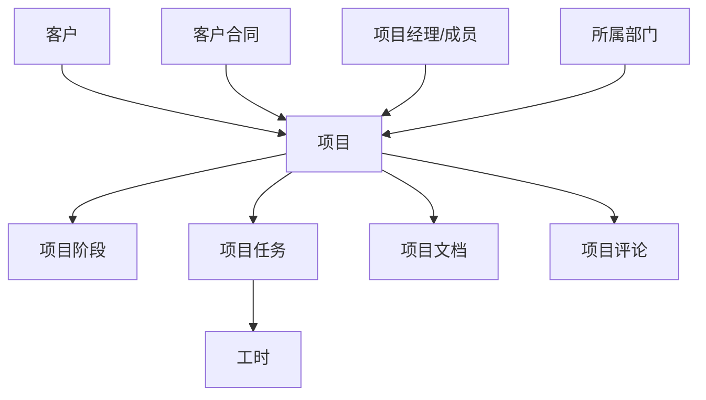

### 10.2 项目核心模型

| 模型 | 业务含义 | 典型关系 |
|---|---|---|
| `Project` | 项目主数据 | 关联客户、客户合同、项目经理、成员、部门 |
| `Stage` | 项目阶段 | 归属于项目，用于阶段化交付 |
| `Task` | 项目内任务 | 归属于项目或阶段，用于交付执行 |
| `WorkHour` | 工时记录 | 关联项目任务、执行人 |
| `ProjectDocument` | 项目文档 | 关联项目和上传文件 |
| `ProjectComment` | 项目评论 | 关联项目、用户、沟通记录 |

### 10.3 独立任务模块 `task`

项目中同时存在 `apps.project.Task` 和 `apps.task.Task`。

| 模型 | 适用场景 | 使用边界 |
|---|---|---|
| `apps.project.Task` | 项目交付过程中的任务 | 必须围绕项目、阶段、工时和交付结果 |
| `apps.task.Task` | 独立协同任务、个人或团队任务 | 不一定关联项目，适合通用任务管理 |

后续开发时必须明确任务来源，不能把项目交付任务和通用协同任务混用。

### 10.4 项目交付链路

| 步骤 | 数据动作 | 结果 |
|---|---|---|
| 合同签订 | 创建项目 | 进入履约管理 |
| 项目立项 | 指定项目经理、成员、部门 | 明确责任主体 |
| 项目规划 | 创建阶段和任务 | 拆分交付工作 |
| 执行过程 | 填写工时、上传文档、评论沟通 | 形成项目过程记录 |
| 项目收尾 | 归档文档、统计成本、触发财务结算 | 形成交付闭环 |

---

## 11. 审批、消息与协同办公模块

### 11.1 通用审批模块 `approval`

`approval` 模块提供通用审批能力。

| 模型 | 业务含义 |
|---|---|
| `Approval` | 审批实例主表 |
| `ApprovalRecord` | 审批记录、审批动作历史 |
| `ApprovalType` | 审批类型定义 |
| `ApprovalFlow` | 审批流程定义 |
| `ApprovalStep` | 审批步骤定义 |

审批通用链路：

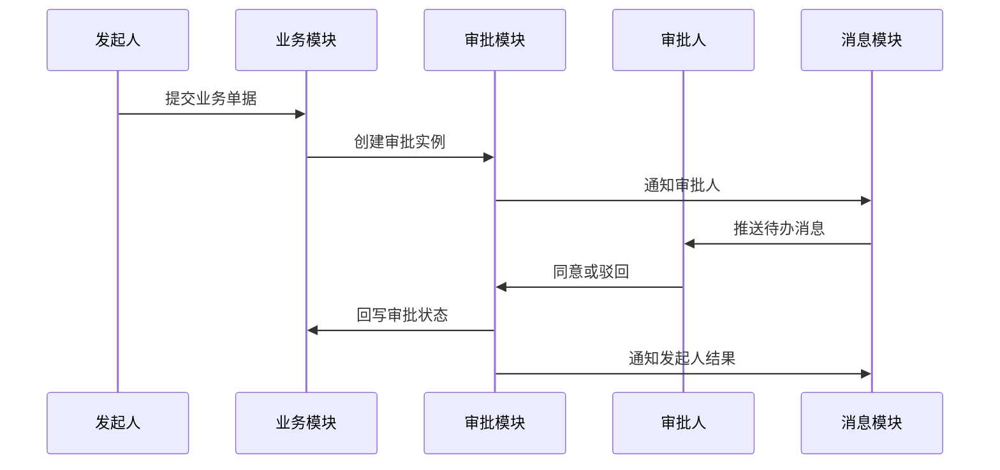

### 11.2 消息模块 `message`

`message` 模块是系统通知中心。

| 模型 | 业务含义 |
|---|---|
| `MessageCategory` | 消息分类 |
| `Message` | 消息主表 |
| `MessageUserRelation` | 用户与消息的读取、接收关系 |
| `NotificationPreference` | 用户通知偏好 |

消息应承担以下职责：

1. 业务事件通知。
2. 审批待办通知。
3. 系统公告通知。
4. 项目任务提醒。
5. 生产异常预警。
6. 库存预警提醒。
7. AI 分析结果或工作流执行结果提醒。

### 11.3 OA 与个人办公

| 模块 | 模型/能力 | 说明 |
|---|---|---|
| `oa` | 会议、OA 消息、OA 审批、日程 | 面向组织办公协作 |
| `personal` | 个人日程、工作记录、工作汇报、便签、个人联系人、会议纪要 | 面向个人工作台和个人效率 |

### 11.4 审批模型并存风险

项目中存在 `apps.approval` 和 `apps.oa` 两套审批相关模型。后续应遵循：

| 场景 | 建议 |
|---|---|
| 跨模块通用审批 | 优先使用 `apps.approval` |
| OA 内部历史审批 | 保留兼容，但新增需求需评估是否迁移到通用审批 |
| 业务单据审批 | 业务模块只维护业务状态，审批过程交给通用审批模块 |
| 消息通知 | 审批状态变化应统一接入 `message` 模块 |

---

## 12. 企业网盘模块

### 12.1 模块定位

`disk` 模块提供企业文件管理、文件夹层级、共享权限、文件操作日志等能力，是项目文档、合同附件、制度文件、生产 SOP 等内容的协同基础。内部共享访问会沿父文件夹权限继承，内部共享页面按真实授权关系展示可访问内容；外链分享除下载与预览外，还支持复制、截图权限控制与对应审计统计。

近期补充说明：

1. 首页标签页使用稳定 URL 生成 `lay-id`，避免旧路径和同名菜单导致 tab 切换错乱。
2. ` /disk/permission/manage/ ` 作为旧路径兼容入口，统一重定向到 ` /disk/permission/?type=...&id=... `。
3. 共享页不再写死示例文件夹，改为按真实共享关系过滤可访问文件和文件夹。
4. 权限管理页的“添加用户/部门”弹窗直接从组织树和部门用户列表加载真实数据，相关页面统一使用本地 `static/js/jquery.min.js`，避免内网或外部 CDN 不可用导致选择用户、部门时报错。
5. 外链分享新增 `allow_copy`、`allow_screenshot` 以及对应成功/拦截统计字段。
6. 外链预览页会记录复制与截图动作，并根据开关决定是否拦截操作。
7. AI 写操作已接入网盘分享与权限变更，支持分享创建、分享更新、停用/删除、公开状态切换、用户/部门共享关系调整，并沿用统一的预览、确认、执行、单条回退链路。
8. 共享文件页会为每个可访问项标注来源用户与共享方式，例如直接共享、部门共享、组织公开或继承父文件夹；添加用户/部门弹窗保存成功后会刷新父级权限页，避免列表停留在旧状态。
9. AI 白话查询已接入网盘文件、文件夹和分享查询；普通用户仅可看到自己拥有、直接共享、部门共享或继承共享范围内的数据，超级管理员可查看全量。
10. 登录接口已修正会话轮换顺序，避免登录成功后被会话中间件误判为过期并打回登录页。

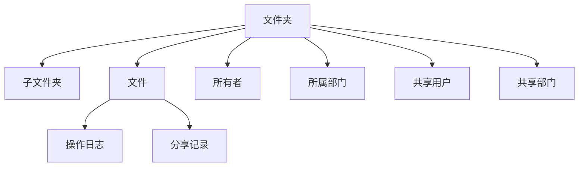

### 12.2 核心模型关系

| 模型/关系 | 说明 |
|---|---|
| 文件夹自关联 | 支持父子文件夹结构 |
| `owner` | 文件或文件夹拥有者，关联全局用户 |
| `department` | 文件所属部门 |
| `shared_users` | 共享给指定用户 |
| `shared_departments` | 共享给指定部门 |
| `DiskShare.allow_copy / allow_screenshot` | 控制外链访问方是否允许复制、截图 |
| `DiskShare.copy_count / screenshot_count` | 记录外链复制、截图成功次数 |
| `DiskShare.copy_blocked_count / screenshot_blocked_count` | 记录外链复制、截图拦截次数 |
| AI 网盘写操作 | 统一接入分享与权限变更，回退按单次 change_set 逆序恢复 |
| `home.js` 标签页 | 使用稳定 URL 作为标签页标识，支持菜单跳转、右键刷新/关闭与状态恢复 |
| `home.js` 标签页右键菜单 | 关闭当前标签、关闭其他标签、关闭所有标签直接操作 DOM 并同步 localStorage，避免依赖 LayUI `tabDelete` 的容器结构约束 |
| 操作日志 | 记录上传、下载、删除、分享等操作 |

### 12.3 业务集成建议

| 业务模块 | 集成方式 |
|---|---|
| 合同 | 合同附件、归档文件可接入网盘或附件服务 |
| 项目 | 项目文档可以沉淀到网盘或项目文档表 |
| 生产 | SOP、质检附件、设备资料可进入网盘管理 |
| 系统公告 | 公告附件可复用附件和网盘能力 |
| AI 知识库 | 网盘文件可作为知识库文档来源，但需要权限过滤 |

---

## 13. 生产 MES 模块

### 13.1 模块定位

`production` 模块覆盖生产基础资料、工艺、BOM、设备、计划、任务、质检、数据采集、生产排程、领料退料、完工入库等能力，是制造业务核心模块。

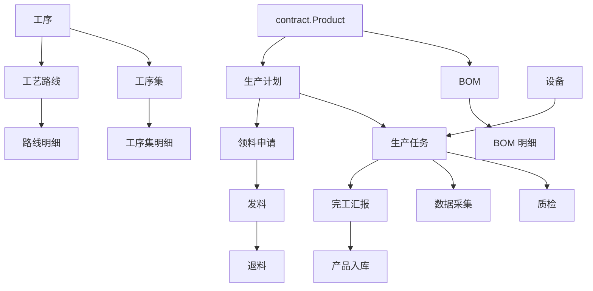

### 13.2 生产基础资料

| 模型 | 说明 |
|---|---|
| `ProductionProcedure` | 生产工序定义 |
| `ProcedureSet` | 工序集合，用于将多个工序组合成标准集合 |
| `ProcedureSetItem` | 工序集明细 |
| `ProcessRoute` | 工艺路线 |
| `ProcessRouteItem` | 工艺路线明细 |
| `BOM` | 产品物料清单 |
| `BOMItem` | BOM 明细物料 |
| `Equipment` | 生产设备 |
| `SOP` | 标准作业指导书 |

### 13.3 生产执行数据

| 模型 | 说明 |
|---|---|
| `ProductionPlan` | 生产计划，关联产品、BOM、工序集、工艺路线、部门、负责人 |
| `ProductionTask` | 生产任务，由计划拆分形成 |
| `QualityCheck` | 质检记录 |
| `DataCollection` | 生产数据采集配置或记录 |
| `DataSource` | 数据源配置，如 MQTT、Modbus 等 |
| `DataMapping` | 采集数据映射关系 |
| `DataCollectionRecord` | 数据采集记录 |
| `ProductionDataPoint` | 生产数据点 |
| `DataCollectionTask` | 数据采集任务 |
| `ProductionOrderChange` | 生产订单变更 |
| `ProductionLineDayPlan` | 产线日计划 |
| `MaterialRequest` | 领料申请 |
| `MaterialIssue` | 发料记录 |
| `MaterialReturn` | 退料记录 |
| `WorkCompletionReport` | 完工汇报 |
| `WorkCompletionRedFlush` | 完工红冲 |
| `ProductReceipt` | 产品入库 |
| `OrderMaterialConfirmation` | 订单物料确认 |
| `ResourceConsumption` | 资源消耗记录 |

### 13.4 生产计划关键关系

`ProductionPlan` 是生产执行主线上的关键模型，典型关系如下：

| 关联对象 | 业务含义 |
|---|---|
| `contract.Product` | 本次生产的产品 |
| `BOM` | 本次生产使用的物料清单 |
| `ProcedureSet` | 标准工序集合 |
| `ProcessRoute` | 工艺路线 |
| `department.Department` | 生产部门 |
| `settings.AUTH_USER_MODEL` | 负责人 |

### 13.5 工业数据采集

生产服务层存在 MQTT、Modbus 等数据采集能力。

| 能力 | 说明 |
|---|---|
| MQTT | 适合从消息代理订阅设备或产线数据 |
| Modbus | 适合连接 PLC、仪表、工业设备采集寄存器数据 |
| 数据源 | 保存采集连接配置 |
| 数据映射 | 将设备点位映射为业务字段 |
| 监控服务 | 存在实时监控能力意图，需结合 Channels/ASGI 配置确认生产可用性 |

### 13.6 生产与库存衔接

---

## 14. 库存进销存模块

### 14.1 模块定位

`inventory` 模块覆盖仓库、库位、物料、库存余额、出入库、调拨、盘点、采购、销售、库存预警和报表，是供应链和生产物料流转中心。

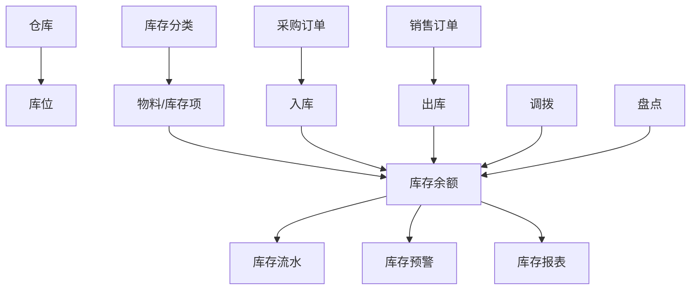

### 14.2 核心模型

| 模型 | 业务含义 |
|---|---|
| `Warehouse` | 仓库主数据 |
| `WarehouseLocation` | 库位 |
| `InventoryCategory` | 库存分类 |
| `InventoryItem` | 物料或库存项主数据 |
| `Inventory` | 库存余额 |
| `StockTransaction` | 库存流水 |
| `StockIn` | 入库单 |
| `StockInItem` | 入库明细 |
| `StockOut` | 出库单 |
| `StockOutItem` | 出库明细 |
| `StockTransfer` | 调拨单 |
| `StockTransferItem` | 调拨明细 |
| `StockCheck` | 盘点单 |
| `StockCheckItem` | 盘点明细 |
| `PurchaseOrder` | 采购订单 |
| `PurchaseOrderItem` | 采购订单明细 |
| `PurchasePriceHistory` | 采购价格历史 |
| `SalesOrder` | 销售订单 |
| `SalesOrderItem` | 销售订单明细 |
| `InventoryAlert` | 库存预警 |
| `InventoryReport` | 库存报表 |

### 14.3 与其他模块关系

| 来源模块 | 关联方式 | 说明 |
|---|---|---|
| `contract.Supplier` | 入库、采购订单关联供应商 | 支撑采购与供应商管理 |
| `production.ProductionPlan` | 入库、领料、生产计划关联 | 支撑生产领料与完工入库 |
| `contract.Product` | 可与物料或成品形成映射 | 支撑产品库存化管理 |
| `finance` | 采购、销售、库存成本可进入财务统计 | 支撑成本与金额核算 |
| `message` | 库存预警触发通知 | 支撑低库存、高库存、临期等提醒 |
| `ai` | 库存预测、补货建议、异常分析 | 支撑智能供应链 |

### 14.4 路由状态提醒

`inventory` 模块已有模型和路由文件，但在主路由中未发现直接挂载 `/inventory/`。如果后续需要直接访问库存页面，应确认菜单入口和根路由挂载策略。

| 状态 | 影响 |
|---|---|
| 应用已存在 | 数据模型和业务路由具备基础 |
| 主路由未直接挂载 | 可能导致页面无法通过 `/inventory/` 访问 |
| 菜单需确认 | 需要检查菜单配置是否存在库存入口 |
| 后续建议 | 明确是否挂载库存根路由，避免功能存在但入口不可达 |

---

## 15. AI 智能模块

### 15.1 模块定位

`ai` 模块是系统智能化能力中心，提供 AI 模型配置、工作流、节点编排、连接关系、执行记录、聊天、知识库、RAG、向量、意图识别、反馈和批量测试能力。

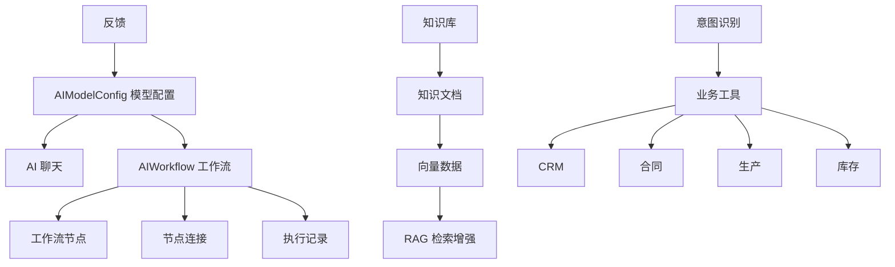

### 15.2 AI 模型配置

`AIModelConfig` 支持多种模型供应商，包括 OpenAI、Azure OpenAI、Anthropic、Google Gemini、百度文心一言、阿里通义千问、腾讯混元、DeepSeek、豆包、Ollama、本地模型等。

| 配置项 | 说明 |
|---|---|
| 供应商 | 指定模型服务来源 |
| 模型名称 | 指定实际模型 |
| API 参数 | 用于调用模型服务，应通过安全方式保存 |
| 启用状态 | 控制模型是否可用 |
| 默认模型 | 支撑聊天、工作流、RAG 默认调用 |

### 15.3 AI 工作流

| 模型/对象 | 说明 |
|---|---|
| `AIWorkflow` | 工作流主实体，包含拥有者、创建人等 |
| 工作流节点 | 表示模型调用、条件判断、工具调用、数据处理等步骤 |
| 工作流连接 | 定义节点之间的流转关系 |
| 执行记录 | 保存工作流运行过程、状态、输入输出 |
| 调试服务 | 支撑工作流调试、监控、异常处理 |
| 权限服务 | 控制工作流访问和执行权限 |

### 15.4 知识库与 RAG

| 能力 | 说明 |
|---|---|
| 知识库 | 管理业务文档、制度、合同、项目资料等知识资产 |
| 文档解析 | 可结合 PDF、Office、文本解析依赖 |
| 向量生成 | 将文档切片后生成向量 |
| 向量质量 | 对向量效果进行质量评估 |
| 查询服务 | 根据用户问题检索相关知识 |
| RAG | 将检索内容与模型生成结合，提升回答准确性 |

### 15.5 AI 与业务模块集成

| 业务模块 | AI 应用场景 |
|---|---|
| CRM | 客户画像、跟进建议、客户分级、线索摘要 |
| 合同 | 风险分析、条款抽取、合同摘要、履约提醒 |
| 财务 | 发票识别、异常金额检测、回款预测 |
| 项目 | 项目风险预测、任务总结、工时分析 |
| 生产 | 排产优化、设备异常分析、质检异常识别 |
| 库存 | 库存预测、补货建议、滞销分析 |
| OA | 智能会议纪要、通知摘要、待办整理 |
| 网盘 | 文档问答、知识检索、权限过滤检索 |

### 15.6 AI Orchestrator

`ai_orchestrator` 提供 AI 编排侧车进程和后台命令。当前 Docker Compose 中存在独立 `ai-orchestrator` 服务，通过管理命令运行。

| 能力 | 说明 |
|---|---|
| 侧车进程 | 与 Web 服务分离，适合执行持续性 AI 编排任务 |
| 后台命令 | `run_ai_orchestrator` 负责启动编排进程 |
| 心跳机制 | 命令中包含周期性心跳休眠逻辑 |
| 页面/API | 当前未在主路由中直接挂载，需要按需求确认是否开放管理入口 |

---

## 16. 其他辅助模块

### 16.1 `enterprise` 与 `public`

项目中存在 `enterprise.Enterprise` 与 `public.Enterprise` 同名或相近业务对象，其中 `public` 是否注册启用需要进一步确认。

| 风险 | 建议 |
|---|---|
| 企业模型并存 | 新增企业信息功能前必须确认主模型 |
| 未注册模块引用 | 不应直接依赖未启用模块的模型 |
| 数据重复 | 企业资料应统一来源，避免两个企业表数据不一致 |

### 16.2 `spider`

`spider` 模块与客户采集、线索采集、外部数据抓取相关。使用时需注意：

| 关注点 | 建议 |
|---|---|
| 合规性 | 外部数据采集需符合目标网站协议和法律要求 |
| 数据落库 | 采集数据进入客户前应有清洗、去重、审核流程 |
| 任务调度 | 爬虫任务不应阻塞 Web 请求 |
| 异常处理 | 采集失败、限流、验证码等场景应可追踪 |

### 16.3 `work`

`work` 模块属于工作协作辅助能力，后续如扩展任务、汇报、工作台相关功能，应先确认与 `task`、`personal`、`oa` 的边界。

---

## 17. 跨模块业务闭环

### 17.1 客户到财务闭环

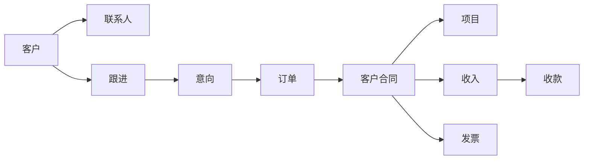

验收重点：

| 环节 | 验证内容 |
|---|---|
| 客户 | 是否能完整记录客户基础信息、来源、等级 |
| 跟进 | 是否能记录销售过程并形成意向 |
| 订单 | 是否能承载成交信息 |
| 合同 | 是否能进入项目和财务 |
| 项目 | 是否能形成交付数据 |
| 财务 | 是否能追踪收入、发票、收款 |

### 17.2 产品到生产库存闭环

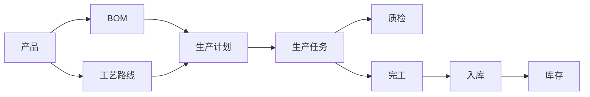

验收重点：

| 环节 | 验证内容 |
|---|---|
| 产品 | 产品编码、分类、状态是否准确 |
| BOM | 物料组成是否正确 |
| 工艺 | 工序、工艺路线是否能被计划引用 |
| 计划 | 计划数量、时间、负责人、部门是否正确 |
| 任务 | 任务拆分、执行、质检是否闭环 |
| 入库 | 完工后库存是否增加并形成流水 |

### 17.3 采购到库存闭环

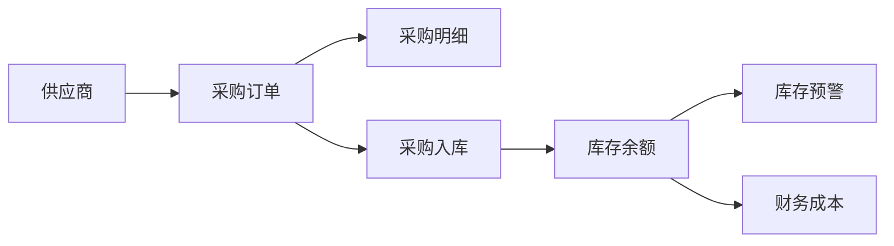

验收重点：

| 环节 | 验证内容 |
|---|---|
| 供应商 | 供应商资料是否完整 |
| 采购订单 | 采购明细、价格、数量是否正确 |
| 入库 | 入库仓库、库位、批次是否正确 |
| 库存 | 库存余额和流水是否一致 |
| 财务 | 是否能支撑采购成本统计 |

### 17.4 审批消息闭环

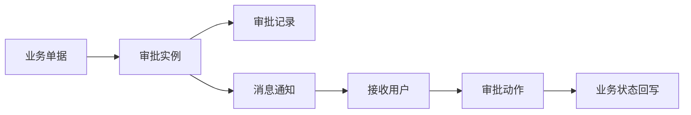

验收重点：

| 环节 | 验证内容 |
|---|---|
| 提交 | 业务单据是否能发起审批 |
| 流程 | 审批步骤是否按配置流转 |
| 通知 | 审批人是否收到消息 |
| 操作 | 同意、驳回、撤回等动作是否正确 |
| 回写 | 业务单据状态是否同步更新 |

---

## 18. 数据权限与审计关注点

### 18.1 数据权限维度

| 维度 | 常见模型字段 | 说明 |
|---|---|---|
| 用户维度 | `created_by`、`owner`、`manager`、`assignee` | 控制个人创建、负责、接收的数据 |
| 部门维度 | `department`、`target_departments`、`shared_departments` | 控制组织范围数据 |
| 角色维度 | `Group`、`Permission` | 控制功能菜单和操作权限 |
| 业务归属 | 客户负责人、项目经理、文件拥有者 | 控制业务对象访问 |
| 共享维度 | `shared_users`、`shared_departments` | 控制协同访问 |

### 18.2 审计日志建议

| 操作类型 | 建议记录内容 |
|---|---|
| 登录登出 | 用户、时间、IP、结果 |
| 新增修改删除 | 操作人、对象、变更前后核心字段 |
| 审批操作 | 审批人、动作、意见、时间 |
| 文件操作 | 上传、下载、分享、删除、预览 |
| 财务操作 | 金额、单据、状态变更、操作人 |
| 权限变更 | 角色、菜单、权限、授权人 |
| AI 调用 | 调用人、模型、业务上下文、输入输出摘要、异常状态 |

---

### 18.3 AI 白话查询权限边界

AI 对话入口的业务查询必须和页面/接口权限保持一致。本轮已接入的自然语言查询边界如下：

| 查询对象 | 可见范围 |
|---|---|
| 审批实例 | 超级管理员全量；普通用户仅申请人、审核人或相关审批任务 |
| 待办审批 | 超级管理员全量；普通用户仅自己处理的任务 |
| 独立任务 | 超级管理员全量；普通用户仅自己负责的任务 |
| 消息 | 超级管理员全量；普通用户仅接收、广播或用户关系表关联消息 |
| 公告 | 超级管理员全量；普通用户仅自己起草或已发布且命中本人/本部门/无目标范围的公告 |
| 会议 | 超级管理员全量；普通用户仅主持、记录、参与、出席或共享会议 |
| 工作日程 | 超级管理员全量；普通用户仅自己创建的日程 |
| 网盘文件 | 超级管理员全量；普通用户仅拥有、直接共享、部门共享或继承共享文件 |
| 网盘文件夹 | 超级管理员全量；普通用户仅拥有、直接共享、部门共享或继承父级共享文件夹 |
| 网盘分享 | 超级管理员全量；普通用户仅自己创建、拥有资源或可访问资源相关分享 |

新增、修改、删除、审批动作、网盘分享/权限变更等写操作仍必须进入 AI 操作预览、用户确认、执行和单条回退链路，不能在自然语言识别后直接写库。

补充说明：

1. 公告白话查询已接入 `Notice` 模型，支持“公告/通知公告/置顶公告/已发布公告/草稿公告”等自然表达。
2. 工作日程白话查询已接入 `Schedule` 模型，支持“日程/排期/安排”等自然表达，并可结合今天、本周、本月等时间范围过滤。

---

## 19. 当前已识别的数据边界风险

| 风险点 | 当前情况 | 建议 |
|---|---|---|
| 部门模型并存 | `apps.department.Department` 与 `apps.user.models.Department` 同时存在 | 新增功能优先使用 `apps.department.Department`，如需迁移需做数据兼容方案 |
| 任务模型并存 | `apps.project.Task` 与 `apps.task.Task` 同时存在 | 项目任务与独立任务边界必须在需求中说明 |
| 审批模型并存 | `apps.approval` 与 `apps.oa` 都有审批相关模型 | 通用审批优先走 `approval`，OA 历史审批谨慎保留 |
| 企业模型并存 | `enterprise.Enterprise` 与 `public.Enterprise` 并存，`public` 状态需确认 | 新增企业资料前先确定唯一主模型 |
| 库存入口 | `inventory` 有模型和路由，但主路由未直接挂载 | 如需上线库存功能需确认根路由和菜单入口 |
| AI 编排入口 | `ai_orchestrator` 有侧车命令，但未见主路由入口 | 如果仅后台运行可保留；如果要管理界面需补设计 |
| 实时能力 | 生产监控服务引用 Channels 能力，但完整 ASGI/Channel Layer 需确认 | 上线 WebSocket 实时监控前必须验证配置 |
| 外部 CDN | 部分页面可能使用外部资源 | 受限网络下建议本地化或使用可信加速源 |

---

## 20. 后续开发前置检查清单

新增任何功能前建议按以下清单检查：

| 检查项 | 必须确认的问题 |
|---|---|
| 模型复用 | 是否已有可复用模型，是否会造成重复数据结构 |
| 模块边界 | 新功能应该属于哪个 `apps` 模块，是否跨模块调用 |
| 路由入口 | 是否需要主路由挂载、子路由、旧路径兼容 |
| 菜单权限 | 是否需要新增菜单、按钮权限、角色授权 |
| 数据权限 | 是否按用户、部门、角色或共享范围过滤 |
| 页面规范 | 是否使用根目录模板、LayUI、右侧 80% 弹层规范 |
| 服务层 | 复杂逻辑是否放入服务层，避免堆在视图中 |
| 审批消息 | 是否需要接入审批和消息通知 |
| 文件附件 | 是否复用附件、网盘或存储服务 |
| AI 能力 | 是否复用 AI 模型配置、工作流和服务层 |
| 运维影响 | 是否新增环境变量、定时任务、队列、外部服务 |
| 数据迁移 | 是否需要迁移脚本、默认值、历史数据兼容 |

---

## 21. 一眼看懂模块边界

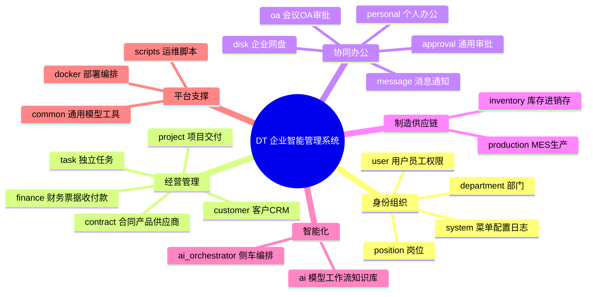

---

## 22. 总结

本项目的数据模型不是简单的单模块数据集合，而是围绕企业经营闭环组织起来的复合业务体系：

1. `Admin` 与 `Department` 构成身份和组织基础。
2. `Customer`、`CustomerOrder`、`CustomerContract` 构成经营起点。
3. `Project`、`Finance` 承接合同履约和资金流。
4. `Product`、`ProductionPlan`、`InventoryItem` 串联产品、生产和库存。
5. `Approval`、`Message`、`Disk`、`OA` 提供横向协同能力。
6. `AIModelConfig`、`AIWorkflow`、知识库和 RAG 让系统具备智能分析与自动化能力。

后续任何新增功能都应优先判断它属于哪条业务链、是否已有主数据、是否需要复用审批消息和权限体系，避免形成新的功能孤岛、数据孤岛或重复模型。
