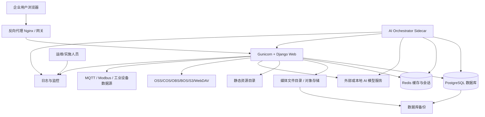
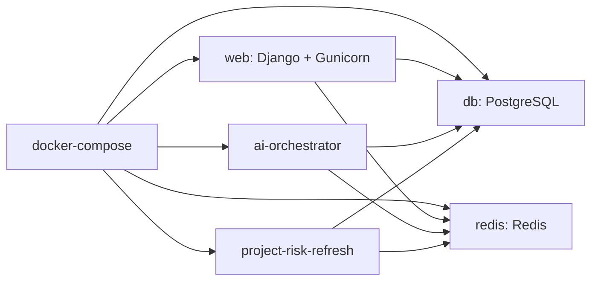
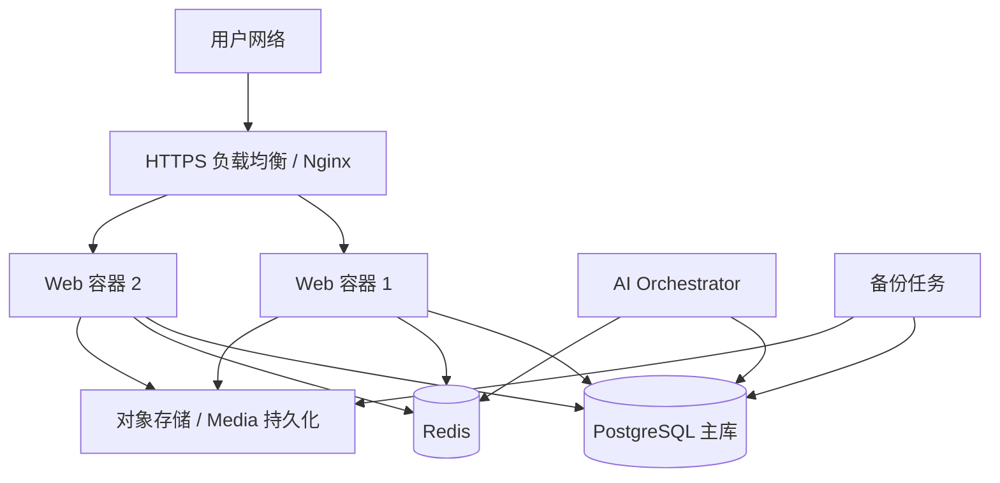
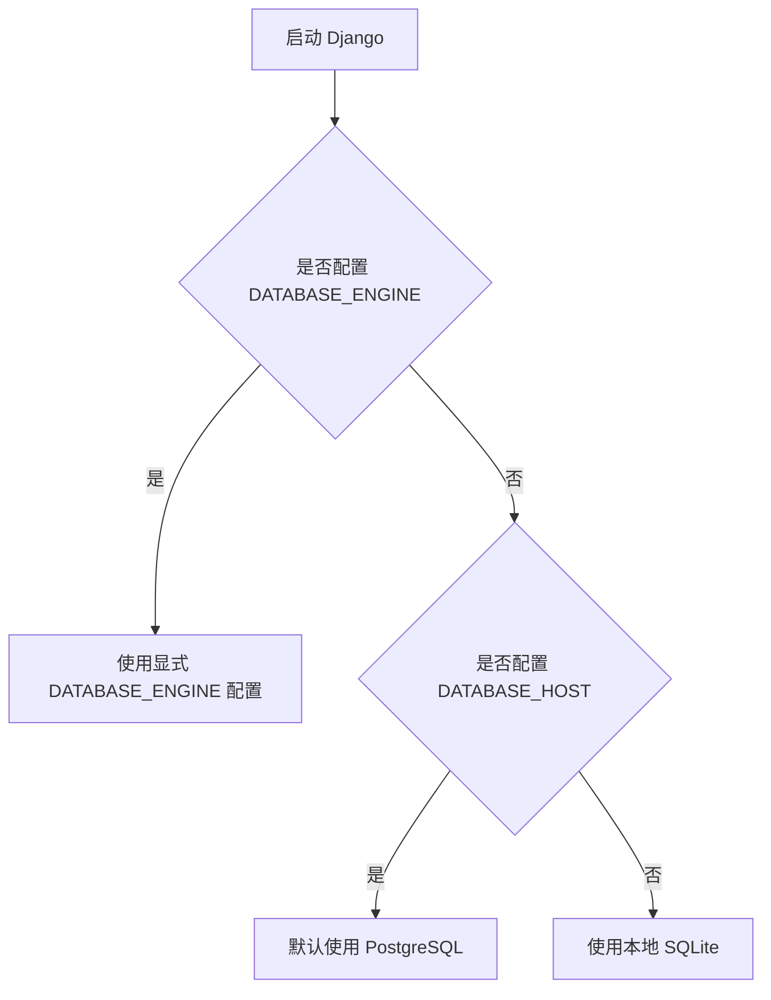
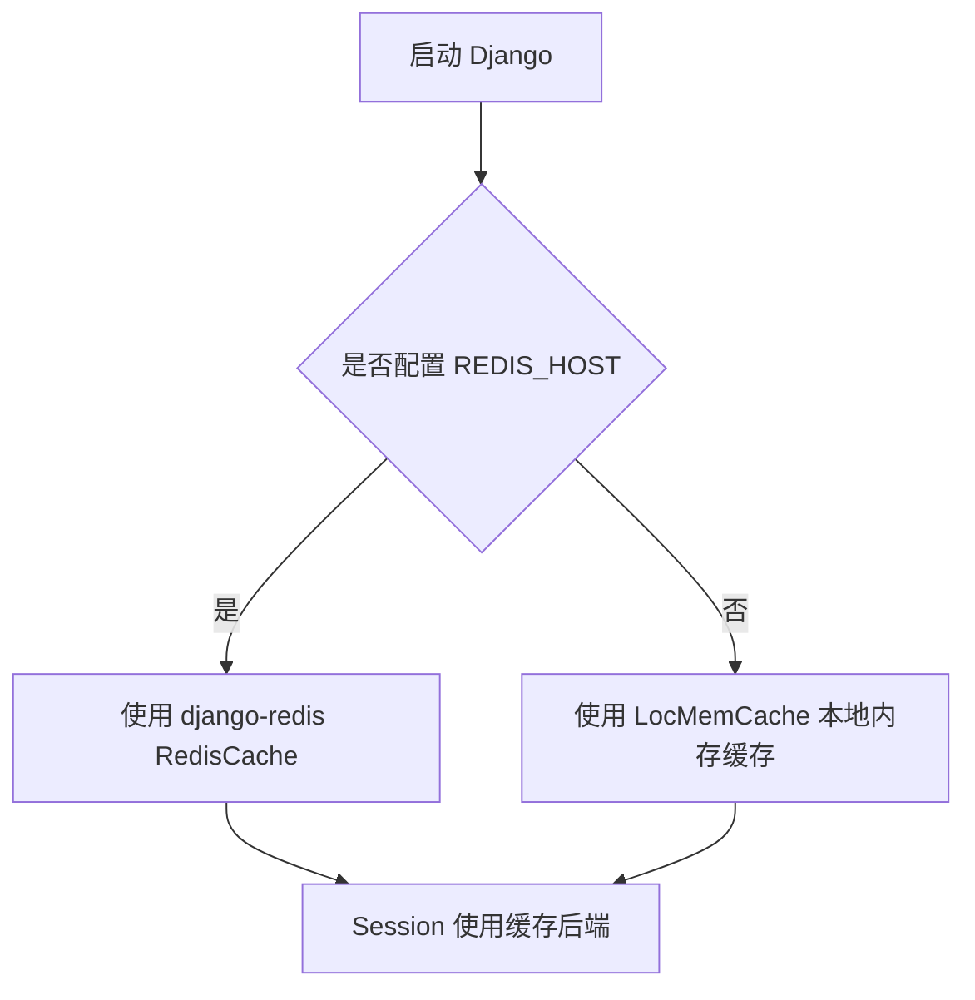
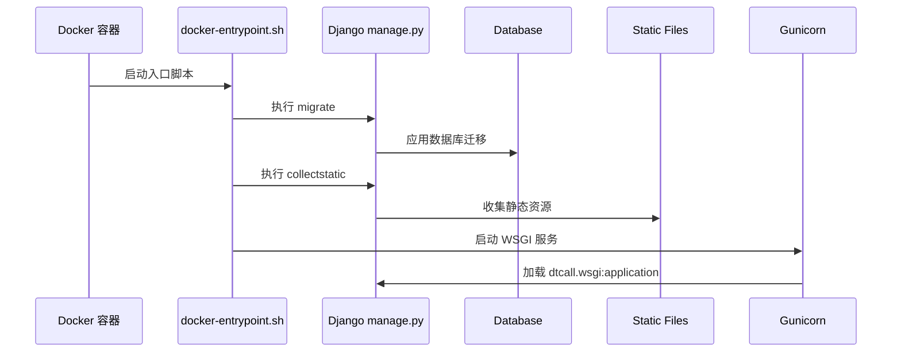
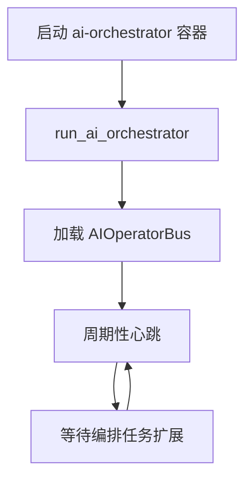
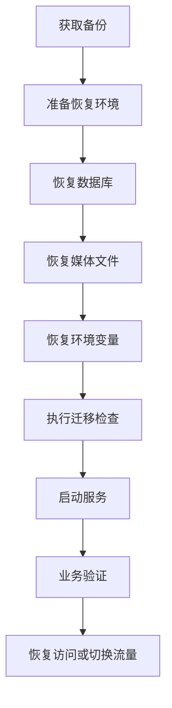

# DT企业智能管理系统部署运行、运维与安全说明

> 文档位置：`documents/05_部署运行与运维安全说明.md`
> 适用对象：运维工程师、后端开发、实施交付、技术负责人、安全负责人
> 文档目标：说明项目如何运行、如何部署、需要哪些环境变量、数据库和缓存如何选择、静态资源与媒体文件如何管理、AI 编排如何启动、生产环境如何做安全与运维治理。

---

## 1. 运维视角的一句话理解

DT 企业智能管理系统是一个以 Django 为核心的企业级后台系统，推荐生产运行形态为：浏览器访问反向代理，反向代理转发到 Gunicorn/Django Web 服务，Django 连接 PostgreSQL、Redis、媒体文件存储和 AI 相关服务，AI Orchestrator 以独立侧车进程执行持续性智能编排任务。

---

## 2. 部署架构总览



生产推荐组合：

| 组件 | 推荐方案 | 说明 |
|---|---|---|
| Web 应用 | Django + Gunicorn | `Dockerfile` 中已安装 Gunicorn，入口脚本使用 Gunicorn 监听 8000 |
| 数据库 | PostgreSQL | `docker-compose.yml` 使用 `postgres:14-alpine` |
| 缓存 | Redis | 用于缓存与 Session，`docker-compose.yml` 使用 `redis:7-alpine` |
| 静态资源 | `collectstatic` 后由 Web 或反向代理提供 | 容器启动脚本会执行 `collectstatic` |
| 媒体文件 | 本地挂载卷或对象存储 | 用户上传文件、文档、图片、合同附件等必须持久化 |
| AI 编排 | 独立 `ai-orchestrator` 服务 | 通过 `python manage.py run_ai_orchestrator` 启动 |
| 项目风险定时刷新 | 独立 `project-risk-refresh` 服务 | 通过 `python manage.py run_project_risk_refresh_scheduler --hour 12 --minute 0` 启动 |
| 反向代理 | Nginx、网关或云负载均衡 | 负责 HTTPS、静态资源、上传大小、超时、转发 |

---

## 3. 项目运行入口

| 入口 | 文件 | 说明 |
|---|---|---|
| Django 管理命令入口 | `manage.py` | 本地运行、迁移、收集静态文件、后台命令统一入口 |
| 主配置 | `dtcall/settings.py` | 应用注册、数据库、缓存、模板、静态文件、DRF、JWT、安全配置 |
| 主路由 | `dtcall/urls.py` | 根路由、业务模块挂载、JWT 接口、旧路径兼容重定向 |
| WSGI 入口 | `dtcall/wsgi.py` | Gunicorn 生产运行入口 |
| ASGI 入口 | `dtcall/asgi.py` | ASGI 应用入口，若启用 WebSocket/Channels 需进一步完善配置 |
| 容器入口 | `docker-entrypoint.sh` | 迁移、收集静态文件、启动 Gunicorn |
| 镜像构建 | `Dockerfile` | Python 3.11 slim 镜像、安装依赖、复制项目、设置入口 |
| 编排配置 | `docker-compose.yml` | PostgreSQL、Redis、Web、AI Orchestrator 服务编排 |

---

## 4. 运行模式说明

### 4.1 本地开发模式

本地开发通常使用：

```bash
python manage.py runserver 127.0.0.1:8000
```

默认情况下，非 Docker 环境在启动 Web 进程时也会自动拉起项目风险定时刷新后台进程，无需再额外手工执行：

```bash
python manage.py run_project_risk_refresh_scheduler --hour 12 --minute 0
```

如需关闭自动拉起，可在环境变量中设置：

```bash
AUTO_START_PROJECT_RISK_REFRESH_SCHEDULER=False
```

本地模式特点：

| 项目 | 行为 |
|---|---|
| 数据库 | 未配置数据库环境变量时自动使用 SQLite |
| 缓存 | 未配置 Redis 时使用本地内存缓存 |
| 静态资源 | Django 开发服务器可处理静态资源 |
| DEBUG | 通常为开启状态，便于开发调试 |
| 适用范围 | 本地开发、功能验证、非生产环境 |

注意事项：

1. 本地 SQLite 只适合开发和临时调试，不适合生产。
2. 本地内存缓存不适合集群和多进程一致性场景。
3. 本地运行不应保存真实生产密钥。
4. 如果涉及上传文件，需要确认 `media/` 目录是否存在且可写。
5. 如果涉及 AI、对象存储、工业采集，需要额外配置对应服务参数。

### 4.2 Docker Compose 模式

项目提供 `docker-compose.yml`，用于启动完整服务栈。

服务组成：



核心服务说明：

| 服务 | 作用 | 默认端口/连接 |
|---|---|---|
| `db` | PostgreSQL 数据库 | 容器内 5432 |
| `redis` | Redis 缓存 | 容器内 6379 |
| `web` | Django Web 服务 | 对外映射 8000 |
| `ai-orchestrator` | AI 编排侧车进程 | 后台命令运行，无默认 Web 端口 |

Web 容器环境变量中包含：

| 变量 | 说明 |
|---|---|
| `DATABASE_HOST=db` | 使用 Compose 内部 PostgreSQL 服务 |
| `DATABASE_PORT=5432` | PostgreSQL 端口 |
| `DATABASE_NAME=dtcall` | 数据库名 |
| `DATABASE_USER=dtcall_user` | 数据库用户 |
| `REDIS_HOST=redis` | 使用 Compose 内部 Redis 服务 |
| `REDIS_PORT=6379` | Redis 端口 |
| `DEBUG=False` | 关闭生产调试模式 |

### 4.3 生产部署模式

生产环境建议采用以下结构：



生产关键要求：

| 要求 | 说明 |
|---|---|
| `DEBUG=False` | 生产必须关闭调试模式 |
| 强密钥 | `DJANGO_SECRET_KEY` 必须使用强随机值，并通过环境变量注入 |
| 数据库持久化 | PostgreSQL 数据目录必须挂载持久卷或使用云数据库 |
| Redis 持久化 | Redis 可按业务需要开启持久化，但 Session 丢失需可接受或配置高可用 |
| 媒体文件持久化 | `media/` 不得只存在容器临时层 |
| HTTPS | 登录、财务、合同、AI 调用等均应通过 HTTPS 访问 |
| 日志收集 | Web、AI Orchestrator、数据库、反向代理日志需集中管理 |
| 备份恢复 | 数据库、媒体文件、对象存储配置、系统配置需纳入备份 |

---

## 5. 数据库配置策略

### 5.1 当前数据库选择逻辑

项目在 `dtcall/settings.py` 中根据环境变量选择数据库：



### 5.2 数据库环境变量

| 变量 | 说明 | 生产建议 |
|---|---|---|
| `DATABASE_ENGINE` | 显式指定 Django 数据库引擎 | 如需特殊数据库引擎时配置 |
| `DATABASE_NAME` | 数据库名称 | 必填 |
| `DATABASE_USER` | 数据库用户名 | 必填，使用最小权限账号 |
| `DATABASE_PASSWORD` | 数据库密码 | 必填，通过安全渠道注入 |
| `DATABASE_HOST` | 数据库地址 | 必填，生产不应为空 |
| `DATABASE_PORT` | 数据库端口 | PostgreSQL 通常为 5432 |

### 5.3 PostgreSQL 生产建议

| 项目 | 建议 |
|---|---|
| 字符集 | 使用 UTF-8 |
| 时区 | 与应用时区保持一致或统一使用 UTC 存储、应用层转换 |
| 连接数 | 根据 Gunicorn worker 数、后台任务和连接池配置评估 |
| 备份 | 每日全量备份，关键业务可增加 WAL 或增量备份 |
| 权限 | Web 应用账号只授予业务所需权限 |
| 索引 | 对客户、合同、项目、生产、库存、财务高频查询字段建立索引 |
| 迁移 | 上线前先在预发执行 `migrate` 验证 |

### 5.4 SQLite 使用边界

SQLite 仅适用于：

1. 本地开发。
2. 临时演示。
3. 快速源码分析。
4. 无并发、无生产数据的验证环境。

SQLite 不适用于：

1. 多用户生产环境。
2. 大量上传和业务写入场景。
3. 多容器部署。
4. 财务、合同、生产、库存正式数据。
5. 高并发业务访问。

---

## 6. Redis、缓存与 Session

### 6.1 当前缓存选择逻辑



### 6.2 Redis 环境变量

| 变量 | 说明 | 生产建议 |
|---|---|---|
| `REDIS_HOST` | Redis 地址 | 生产必须配置 |
| `REDIS_PORT` | Redis 端口 | 默认 6379 |
| `REDIS_PASSWORD` | Redis 密码 | 生产建议配置 |

### 6.3 Redis 使用场景

| 场景 | 说明 |
|---|---|
| Session | 项目使用 cache session backend，登录状态依赖缓存 |
| 页面缓存 | 可缓存系统配置、菜单、统计等数据 |
| 权限缓存 | 菜单权限、数据权限可通过缓存优化 |
| AI 任务状态 | 可用于保存 AI 工作流中间状态或执行锁 |
| 生产监控 | 如扩展实时数据，可使用 Redis 做中间缓存或消息通道 |

### 6.4 Redis 运维建议

| 项目 | 建议 |
|---|---|
| 密码 | 生产必须设置密码或使用内网隔离 |
| 网络 | Redis 不应暴露到公网 |
| 内存 | 设置合理内存上限和淘汰策略 |
| 持久化 | 根据 Session 和任务状态重要性决定是否启用 RDB/AOF |
| 高可用 | 重要生产环境可使用托管 Redis 或 Sentinel/Cluster |
| 监控 | 监控内存、连接数、慢查询、命中率、过期键数量 |

---

## 7. 静态资源与媒体文件

### 7.1 静态资源

项目静态资源目录为 `static/`，Django 配置中 `STATIC_URL = '/static/'`，容器入口脚本会执行：

```bash
python manage.py collectstatic --noinput
```

静态资源包括：

| 类型 | 示例 |
|---|---|
| CSS | LayUI、公共样式、AI 动态主题样式 |
| JavaScript | jQuery、LayUI、后台主框架脚本、AI SDK |
| 图片 | 系统图标、页面资源 |
| 第三方前端库 | 本地化后的 LayUI、jQuery 等 |

生产建议：

1. 静态资源由 Nginx 或对象存储/CDN 提供时性能更好。
2. 受限网络环境下不建议依赖外部 CDN。
3. 新增页面应使用项目已有静态资源体系，不应引入孤立前端工程。
4. 静态资源更新后需重新执行 `collectstatic`。

### 7.2 媒体文件

项目媒体文件目录为 `media/`，Django 配置中 `MEDIA_URL = '/media/'`，`MEDIA_ROOT` 指向项目根目录下的 `media`。

媒体文件包括：

| 类型 | 说明 |
|---|---|
| 用户头像 | 用户、员工头像等 |
| 合同附件 | 合同文件、扫描件、归档材料 |
| 客户附件 | 跟进附件、客户资料 |
| 项目文档 | 项目交付文档、过程资料 |
| 网盘文件 | 企业网盘上传文件 |
| 生产资料 | SOP、质检附件、设备资料 |
| AI 知识库文档 | 用于解析、向量化和 RAG 的文档 |

生产必须注意：

1. `media/` 必须持久化，不得只保存在容器临时文件系统中。
2. 多 Web 节点部署时，媒体文件应使用共享存储或对象存储。
3. 媒体文件应纳入备份策略。
4. 敏感文件下载必须经过权限校验，不应直接暴露未鉴权 URL。
5. 大文件上传需配置反向代理上传大小、超时时间和后端处理策略。

### 7.3 对象存储

项目依赖中包含 OSS、COS、OBS、BOS、七牛、S3、WebDAV 等能力，系统模块中存在存储配置和存储服务。

| 存储类型 | 适合场景 |
|---|---|
| 本地存储 | 本地开发、小规模部署、单节点部署 |
| 对象存储 | 生产环境、多节点部署、大量附件、文档、图片 |
| WebDAV | 私有文件服务、企业内部文档存储 |
| S3 兼容存储 | 云原生或私有云存储场景 |

对象存储安全要求：

1. AccessKey、SecretKey 不得硬编码。
2. 存储桶权限应最小化，默认不公开敏感文件。
3. 私有文件建议使用后端鉴权后生成临时访问链接。
4. 删除文件需考虑业务记录、审计日志和软删除策略。

---

## 8. 容器启动生命周期

`docker-entrypoint.sh` 描述了容器启动过程。



启动步骤：

| 步骤 | 命令 | 作用 |
|---|---|---|
| 数据库迁移 | `python manage.py migrate --noinput` | 创建或更新数据库结构 |
| 静态资源收集 | `python manage.py collectstatic --noinput` | 收集静态文件到部署目录 |
| 启动 Web | `gunicorn dtcall.wsgi:application --bind 0.0.0.0:8000 --workers 4` | 启动生产 Web 服务 |

运维注意：

1. 首次部署前数据库必须可连接。
2. 如果迁移失败，容器启动会失败或服务不可用。
3. 如果静态资源收集失败，页面样式和 JS 可能异常。
4. worker 数需要根据 CPU、内存、并发量调整。
5. 大量 AI、文档解析、工业采集任务不宜阻塞 Web worker。

---

## 9. AI Orchestrator 运维说明

### 9.1 运行方式

Docker Compose 中存在 `ai-orchestrator` 服务，启动命令为：

```bash
python manage.py run_ai_orchestrator
```

该命令会加载 AI 编排相关对象，并以心跳方式持续运行。



### 9.2 适合放入 AI Orchestrator 的任务

| 任务类型 | 说明 |
|---|---|
| AI 工作流后台执行 | 长耗时、多步骤、可重试的工作流 |
| 知识库文档处理 | 文档解析、切片、向量化 |
| 批量测试 | 模型批量评估、工作流批量验证 |
| 异步分析 | 合同风险分析、库存预测、生产排程优化 |
| 定时智能任务 | 周期性业务摘要、预警分析、智能报表 |

### 9.3 运维关注点

| 项目 | 建议 |
|---|---|
| 进程健康 | 监控容器是否持续运行 |
| 日志 | 单独收集 AI Orchestrator 日志 |
| 重试 | 长任务需具备失败重试或人工恢复机制 |
| 密钥 | AI API Key 通过环境变量或安全配置注入 |
| 资源 | 文档解析、向量化、模型调用可能消耗 CPU、内存和网络 |
| 限流 | 外部 AI 服务调用需考虑限速、超时、失败降级 |

---

## 10. 环境变量清单

### 10.1 Django 基础变量

| 变量 | 说明 | 生产要求 |
|---|---|---|
| `DJANGO_SETTINGS_MODULE` | Django 配置模块 | 通常为 `dtcall.settings` |
| `DJANGO_SECRET_KEY` | Django 加密密钥 | 必须配置强随机值 |
| `DEBUG` | 调试开关 | 必须为 `False` |
| `ALLOWED_HOSTS` | 允许访问域名 | 必须配置真实域名/IP |
| `CSRF_TRUSTED_ORIGINS` | CSRF 信任源 | 使用 HTTPS 域名时需配置 |
| `TZ` | 容器时区 | 建议与业务时区一致 |

### 10.2 数据库变量

| 变量 | 说明 | 示例含义 |
|---|---|---|
| `DATABASE_ENGINE` | 数据库引擎 | 显式指定时使用 |
| `DATABASE_NAME` | 数据库名 | `dtcall` |
| `DATABASE_USER` | 数据库用户 | `dtcall_user` |
| `DATABASE_PASSWORD` | 数据库密码 | 不得写入代码仓库 |
| `DATABASE_HOST` | 数据库主机 | `db` 或数据库内网地址 |
| `DATABASE_PORT` | 数据库端口 | `5432` |

### 10.3 Redis 变量

| 变量 | 说明 |
|---|---|
| `REDIS_HOST` | Redis 主机 |
| `REDIS_PORT` | Redis 端口 |
| `REDIS_PASSWORD` | Redis 密码 |

### 10.4 AI 与外部服务变量

项目支持多种 AI 和云服务能力，实际变量名称需与服务实现保持一致。运维原则如下：

| 类型 | 安全要求 |
|---|---|
| AI API Key | 不得硬编码，不得提交到仓库，不得输出到日志 |
| 对象存储密钥 | 使用环境变量、密钥管理系统或后台加密配置 |
| 短信/邮件服务密钥 | 按最小权限申请，定期轮换 |
| 工业设备连接参数 | 内网隔离，限制访问来源 |
| 第三方接口 Token | 设置过期和轮换策略 |

---

## 11. 反向代理与网络配置

### 11.1 推荐反向代理职责

| 职责 | 说明 |
|---|---|
| HTTPS 终止 | 统一处理 TLS 证书 |
| 域名路由 | 将业务域名转发到 Django Web 服务 |
| 静态资源 | 可直接提供 `/static/` 静态文件 |
| 媒体文件 | 可代理 `/media/`，但敏感文件需鉴权 |
| 上传限制 | 配置大文件上传大小 |
| 超时控制 | AI、文件解析、大查询场景需合理超时 |
| 安全头 | 配置 HSTS、X-Frame-Options、Content-Security-Policy 等 |
| 日志 | 记录访问日志和错误日志 |

### 11.2 网络安全建议

| 组件 | 暴露策略 |
|---|---|
| Web 服务 | 可通过反向代理对外暴露 |
| PostgreSQL | 仅内网访问，不对公网开放 |
| Redis | 仅内网访问，不对公网开放 |
| AI Orchestrator | 默认不对外暴露端口 |
| 对象存储 | 私有桶优先，通过后端鉴权访问 |
| 工业设备 | 建议通过内网、VPN 或专线访问 |

---

## 12. 安全配置要求

### 12.1 Django 安全项

| 安全项 | 要求 |
|---|---|
| `DEBUG` | 生产必须关闭 |
| `SECRET_KEY` | 必须使用强随机值，不能使用默认值 |
| `ALLOWED_HOSTS` | 必须限制为真实域名或内网地址 |
| CSRF | 表单和 AJAX 请求必须携带 CSRF Token |
| Session Cookie | 生产 HTTPS 下应启用安全 Cookie 配置 |
| JWT | Token 过期时间和刷新策略应符合安全要求 |
| 文件上传 | 限制类型、大小，并进行权限校验 |
| 错误页面 | 生产不应暴露堆栈和内部路径 |

### 12.2 权限安全


权限要求：

| 要求 | 说明 |
|---|---|
| 菜单权限 | 用户只能看到被授权菜单 |
| 接口权限 | 不可只依赖前端隐藏菜单，后端必须校验 |
| 数据权限 | 客户、合同、项目、财务、文件等应按用户和部门过滤 |
| 管理员权限 | 超级管理员权限应严格控制 |
| 审批权限 | 审批动作只能由当前步骤审批人执行 |
| 文件权限 | 网盘内部共享、外链分享、下载、预览必须校验用户或部门范围 |
| AI 权限 | AI 知识检索不能绕过原始文件或业务数据权限 |

### 12.3 敏感数据保护

| 数据类型 | 保护措施 |
|---|---|
| 用户密码 | 使用 Django 密码哈希，不得明文保存 |
| 数据库密码 | 环境变量或密钥系统注入 |
| AI Key | 不进入日志，不进入前端，不进入仓库 |
| 财务数据 | 严格角色和部门权限控制 |
| 合同文件 | 私有存储、鉴权访问、操作审计 |
| 客户信息 | 防止越权查看和批量导出滥用 |
| 工业设备参数 | 内网隔离、最小权限、操作留痕 |

### 12.4 文件安全

| 风险 | 防护建议 |
|---|---|
| 恶意文件上传 | 限制扩展名、MIME、大小，必要时接入安全扫描 |
| 路径穿越 | 文件路径必须由后端生成，不接受任意路径参数 |
| 未授权下载 | 下载接口必须鉴权并检查文件权限 |
| 外链二次扩散 | 对外分享应配置复制、截图、下载等权限并保留访问审计；复制/截图控制属于浏览器侧限制，需结合水印、短期有效期和审计日志共同防护 |
| 大文件压垮服务 | 限制上传大小，使用分片或异步处理 |
| 知识库泄密 | AI 文档问答必须绑定文档权限和用户权限 |

---

## 13. 日志、监控与告警

### 13.1 日志分类

| 日志类型 | 来源 | 用途 |
|---|---|---|
| Web 访问日志 | Nginx、Gunicorn | 分析访问量、状态码、慢请求 |
| Django 应用日志 | Django 视图、服务层 | 排查业务异常 |
| 数据库日志 | PostgreSQL | 慢查询、连接、锁等待、错误 |
| Redis 日志 | Redis | 连接、内存、慢命令 |
| AI 日志 | AI 服务、AI Orchestrator | 模型调用、工作流执行、异常分析 |
| 文件日志 | 网盘、附件、上传下载 | 审计文件操作 |
| 安全日志 | 登录、权限、操作审计 | 安全追踪和合规审计 |

### 13.2 关键监控指标

| 组件 | 指标 |
|---|---|
| Web | QPS、响应时间、5xx、4xx、worker 数、内存、CPU |
| PostgreSQL | 连接数、慢查询、锁等待、TPS、磁盘空间、备份状态 |
| Redis | 内存使用、连接数、命中率、过期键、慢命令 |
| 文件存储 | 容量、上传失败率、下载失败率、访问延迟 |
| AI | 调用次数、成功率、超时率、Token 消耗、异常模型 |
| 生产采集 | 数据源连接状态、采集延迟、设备异常 |
| 业务 | 登录失败次数、审批积压、库存预警、生产异常 |

### 13.3 告警建议

| 告警项 | 建议触发条件 |
|---|---|
| Web 5xx | 短时间内持续增加 |
| 数据库连接 | 接近最大连接数 |
| 磁盘空间 | 数据库或媒体盘剩余空间低 |
| Redis 内存 | 接近上限或频繁淘汰 |
| 登录失败 | 同一账号或 IP 高频失败 |
| AI 调用失败 | 外部模型连续超时或鉴权失败 |
| 备份失败 | 定时备份任务失败 |
| 工业采集中断 | 数据源长时间无数据 |

---

## 14. 备份与恢复

### 14.1 必须备份的内容

| 内容 | 原因 |
|---|---|
| PostgreSQL 数据库 | 保存所有核心业务数据 |
| `media/` 目录 | 保存用户上传文件、合同附件、网盘文件、知识库文档 |
| 对象存储文件 | 如果启用对象存储，必须备份或开启版本保护 |
| 环境变量配置 | 恢复服务需要数据库、Redis、密钥、存储配置 |
| 系统配置 | 菜单、权限、存储配置、服务配置等 |
| 部署配置 | Docker Compose、镜像版本、反向代理配置 |

### 14.2 备份策略建议

| 环境 | 策略 |
|---|---|
| 开发环境 | 可按需备份，重点保护样例配置 |
| 测试环境 | 发布前备份，用于问题复现 |
| 预发环境 | 与生产结构一致，发布前后备份 |
| 生产环境 | 每日全量备份，关键系统增加增量或实时归档 |

### 14.3 恢复演练流程



恢复验证重点：

1. 用户能登录。
2. 菜单权限正常。
3. 客户、合同、项目、财务数据可查询。
4. 上传文件、网盘文件、合同附件可访问。
5. 生产和库存数据一致。
6. AI 配置存在但密钥不泄露。
7. 审批和消息状态完整。

---

## 15. 发布与变更流程

### 15.1 推荐发布流程


### 15.2 发布前检查清单

| 检查项 | 说明 |
|---|---|
| 依赖变化 | `requirements.txt` 是否更新，是否使用可信源安装 |
| 数据迁移 | 是否有 Django migration，是否可在预发成功执行 |
| 环境变量 | 是否新增变量，生产是否已配置 |
| 静态资源 | 是否需要重新 collectstatic |
| 模板变更 | 是否符合根目录模板和 LayUI 规范 |
| 菜单权限 | 新页面是否配置菜单和权限 |
| 数据权限 | 新接口是否做数据范围限制 |
| 文件权限 | 上传下载是否鉴权 |
| AI 调用 | 是否配置密钥、超时、失败降级 |
| 数据备份 | 生产发布前是否完成备份 |
| 回滚方案 | 镜像、数据库和媒体文件是否可回退 |

### 15.3 发布后验证清单

| 验证项 | 说明 |
|---|---|
| 登录 | 用户登录、验证码、退出是否正常 |
| 首页 | 后台主框架、菜单、Tab、iframe 是否正常 |
| 核心模块 | 客户、合同、财务、项目、生产、库存入口是否正常 |
| 弹层规范 | 新增、编辑、详情是否按右侧 80% 弹层展示 |
| 文件 | 上传、预览、下载、分享是否正常 |
| 审批消息 | 待办消息、审批流转是否正常 |
| AI | 模型配置、聊天、工作流入口是否正常 |
| 日志 | 无持续 500 错误，无明显慢查询和异常堆栈 |

---

## 16. 常见故障排查

### 16.1 服务无法启动

| 现象 | 可能原因 | 排查方向 |
|---|---|---|
| 容器启动后退出 | 数据库不可连接、迁移失败、依赖缺失 | 查看 Web 容器日志、数据库连接配置 |
| Gunicorn 无响应 | worker 启动失败、端口占用 | 查看 Gunicorn 日志和容器端口 |
| 页面 500 | Django 异常、模板错误、数据库字段缺失 | 查看 Django 应用日志 |
| 静态资源 404 | 未执行 collectstatic、反向代理路径错误 | 检查静态文件目录和 Nginx 配置 |
| 登录后跳转异常 | Session 缓存异常、Redis 不可用 | 检查 Redis 连接和 Session 配置 |

### 16.2 数据库问题

| 现象 | 可能原因 | 排查方向 |
|---|---|---|
| 迁移失败 | 表已存在、字段冲突、历史迁移不一致 | 在预发复现并检查 migration 依赖 |
| 查询慢 | 缺少索引、数据量大、复杂联表 | 查看慢查询，增加索引或优化查询 |
| 连接过多 | worker 过多、连接未释放 | 检查 Gunicorn worker 和数据库连接数 |
| 数据乱码 | 字符集不一致 | 确认数据库编码为 UTF-8 |

### 16.3 文件问题

| 现象 | 可能原因 | 排查方向 |
|---|---|---|
| 上传失败 | 目录不可写、文件过大、反向代理限制 | 检查媒体目录权限和上传大小配置 |
| 下载 403 | 权限不足或鉴权失败 | 检查文件共享、部门、用户权限 |
| 文件丢失 | 未持久化 `media/`、容器重建 | 检查卷挂载和备份 |
| 预览失败 | 文件格式不支持、解析依赖异常 | 检查文档解析依赖和日志 |

### 16.4 AI 问题

| 现象 | 可能原因 | 排查方向 |
|---|---|---|
| AI 调用失败 | API Key 未配置、模型服务不可达 | 检查模型配置和网络 |
| 工作流不执行 | Orchestrator 未启动、任务状态异常 | 查看 AI Orchestrator 日志 |
| RAG 回答不准确 | 文档未解析、向量未生成、召回效果差 | 检查知识库文档和向量服务 |
| 调用超时 | 模型响应慢、网络不稳定 | 配置超时、重试和降级策略 |

### 16.5 生产采集问题

| 现象 | 可能原因 | 排查方向 |
|---|---|---|
| MQTT 无数据 | Broker 不可达、Topic 错误、权限失败 | 检查数据源配置和网络 |
| Modbus 连接失败 | IP/端口错误、设备离线、寄存器配置错误 | 检查设备网络和点位映射 |
| 监控页面不刷新 | 实时通道未配置、采集任务异常 | 检查 Channels/ASGI 和采集服务 |

---

## 17. 性能优化建议

### 17.1 后端性能

| 方向 | 建议 |
|---|---|
| ORM 查询 | 对高频列表使用分页、过滤、索引，避免无界查询 |
| 跨表关联 | 使用合适的 `select_related`、`prefetch_related` |
| 统计报表 | 大范围统计可做缓存或异步汇总 |
| 文件处理 | 大文件解析、AI 向量化应异步化 |
| Gunicorn | 根据 CPU 和内存调整 worker 数 |
| 缓存 | 菜单、系统配置、字典数据可缓存 |

### 17.2 数据库性能

| 模块 | 高频索引建议方向 |
|---|---|
| 客户 | 客户名称、负责人、部门、创建时间、状态 |
| 合同 | 合同编号、客户、状态、签订时间、负责人 |
| 财务 | 单据号、合同、客户、状态、日期、金额 |
| 项目 | 项目状态、经理、部门、合同、创建时间 |
| 生产 | 计划编号、产品、状态、部门、计划日期 |
| 库存 | 物料、仓库、库位、批次、流水时间 |
| 消息 | 接收人、读取状态、创建时间 |
| AI | 工作流、执行状态、创建人、执行时间 |

### 17.3 前端性能

| 方向 | 建议 |
|---|---|
| LayUI 表格 | 使用服务端分页和条件查询 |
| iframe Tab | 避免一次打开过多重页面 |
| 静态资源 | 本地化依赖、压缩资源、合理缓存 |
| 弹层页面 | 详情、编辑使用右侧 80% 弹层，减少整页跳转 |
| 图表页面 | 大数据图表应分页、聚合或按时间范围查询 |

---

## 18. 合规与数据治理

### 18.1 数据生命周期

| 阶段 | 管理要求 |
|---|---|
| 创建 | 校验输入、记录创建人和时间 |
| 使用 | 按权限访问，避免越权查询 |
| 修改 | 记录修改人、时间和关键变更 |
| 删除 | 优先软删除，避免破坏业务链路 |
| 归档 | 合同、项目、财务、生产资料需可归档 |
| 备份 | 关键数据定期备份 |
| 销毁 | 敏感数据销毁需符合企业制度 |

### 18.2 高敏业务数据

| 数据 | 管理要求 |
|---|---|
| 客户资料 | 限制导出、限制批量查看、操作留痕 |
| 合同文件 | 权限访问、下载记录、归档管理 |
| 财务金额 | 严格角色授权、审批流程、审计日志 |
| 员工信息 | 人事数据最小可见原则 |
| AI 语料 | 不得将无权限文档暴露给 AI 检索 |
| 设备数据 | 工业网络隔离，防止非法控制或泄露 |

---

## 19. 与项目开发规则相关的运维注意事项

| 规则 | 运维落点 |
|---|---|
| 不创建垃圾文件 | 部署目录、日志目录、临时目录需定期清理 |
| 不使用模拟数据污染正式环境 | 演示、测试、导入数据需与生产隔离 |
| 不硬编码敏感信息 | 所有密钥通过环境变量、密钥管理或后台安全配置注入 |
| 前端风格一致 | 新页面上线前检查是否使用 LayUI 和统一模板 |
| 二级页面右侧 80% 弹层 | 验收新增、编辑、详情页交互方式 |
| 受限网络优先国内源 | 安装依赖时优先使用国内源或可信加速源 |
| 不提交代码到 GitHub | 运维部署和修复不应主动执行 Git 提交或推送 |

---

## 20. 上线交付最终检查表

| 分类 | 检查项 | 状态 |
|---|---|---|
| 基础配置 | `DEBUG=False` | 待检查 |
| 基础配置 | `DJANGO_SECRET_KEY` 已配置强随机值 | 待检查 |
| 基础配置 | `ALLOWED_HOSTS` 已配置生产域名 | 待检查 |
| 数据库 | PostgreSQL 可连接 | 待检查 |
| 数据库 | 数据库已备份 | 待检查 |
| 数据库 | 迁移已在预发验证 | 待检查 |
| Redis | Redis 可连接且不暴露公网 | 待检查 |
| 静态资源 | `collectstatic` 成功 | 待检查 |
| 媒体文件 | `media/` 或对象存储已持久化 | 待检查 |
| 权限 | 登录、菜单、数据权限正常 | 待检查 |
| 核心业务 | 客户、合同、财务、项目正常 | 待检查 |
| 生产库存 | 生产、库存入口和关键流程正常 | 待检查 |
| AI | AI 配置、工作流、Orchestrator 状态正常 | 待检查 |
| 安全 | HTTPS、CSRF、Cookie、安全头已配置 | 待检查 |
| 日志 | Web、数据库、Redis、AI 日志可查看 | 待检查 |
| 监控 | 关键指标和告警已配置 | 待检查 |
| 备份 | 数据库、媒体文件、配置已纳入备份 | 待检查 |
| 回滚 | 镜像和数据库回滚方案已确认 | 待检查 |

---

## 21. 总结

本项目生产运行的关键不只是启动 Django 服务，而是确保以下能力整体可靠：

1. PostgreSQL 保存核心业务数据，必须稳定、备份、可恢复。
2. Redis 承担缓存和 Session，生产应使用独立 Redis 服务。
3. `media/` 和对象存储保存大量业务文件，必须持久化并做权限控制。
4. Gunicorn 适合作为 Django 生产入口，前面应有 HTTPS 反向代理。
5. AI Orchestrator 应作为独立后台进程监控，避免长任务阻塞 Web。
6. 客户、合同、财务、生产、库存、网盘、AI 涉及大量敏感数据，必须严格执行认证、权限、数据权限、审计和备份策略。
7. 每次发布都应先备份、再迁移、再验证，确保业务链路和数据安全不受影响。
